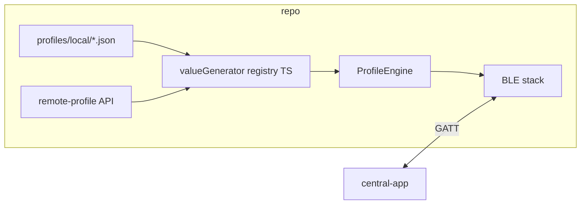

# Architecture

## Overview

This repository implements a **two-app BLE demo**:

| App | Role | Library | Typical device |
|-----|------|---------|----------------|
| `peripheral-app/` | GATT server + advertiser | `rn-ble-peripheral-module` | **Android** (peripheral mode) |
| `central-app/` | Scanner + GATT client | `react-native-ble-manager` | **iOS or Android** |

Behavior of the peripheral is driven by **JSON profiles**: bundled under [`profiles/local/`](../profiles/local/) and/or **fetched at runtime** from the [**remote-profile**](../remote-profile/) service (see [remote-profiles.md](./remote-profiles.md)). TypeScript maps optional `valueGenerator` keys to concrete simulation blocks before the shared **profile engine** runs (migrated from `rn-ble-peripheral-module` example branch `test-pripheral-config-profile-mar23`).

## Peripheral stack

1. **JSON profile** — device name, advertising, services/characteristics, optional state machine.
2. **`applyValueGenerators`** — expands `valueGenerator` strings into `simulation` / `stateOverrides` fragments understood by the engine.
3. **`ProfileEngine`** — registers services, handles read/write/notify, runs `SimulationRunner` and `StateMachineRunner` (subscribe/write/timer/manual transitions).
4. **`ProfileApp` UI** — profile selection, start/stop peripheral, dynamic controls from profile `ui` hints, log panel.

## Central stack

1. **`BleManager.start`** — initialize the native central manager.
2. **`scan`** — for standard 16-bit services (Heart Rate), the OS service UUID filter narrows results. For 128-bit UUIDs (Nordic LBS), a **broad scan** runs instead and `matchesTarget()` in JS filters by advertised service UUID or name hints (e.g. `my_lbs`). Scan is stopped on connect; the UI blocks another scan or target change until disconnect.
3. **`connect` → `retrieveServices`** — discover the GATT layout.
4. **DIS reads** (`src/disRead.ts`) — optional reads of standard Device Information characteristics (0x180A) for the **Info** panel when the peripheral exposes them.
5. **`startNotification` / `write`** — heart rate + battery notifications, or Nordic LBS button notifications and LED writes (**LED ON** before **LED OFF** in the demo UI).

## Peripheral automation (Android)

The peripheral app supports **ADB broadcast intents** for automation. When `registerBroadcastReceiver` is called, the native module forwards intents matching configured actions to JavaScript. The `ProfileApp` handles commands such as `TRG_START_PERIPHERAL`, `TRG_BUTTON_STATE_ON`, `TRG_BATTERY_PLUS_10`, and `TRG_SHOW_LOGS` — see `automation/` and `peripheral-app/src/ProfileApp.tsx` for details.

## Design choices

- **Reuse first**: Core BLE profile logic is copied from the library example with minimal edits; behavior stays aligned with a known-good implementation.
- **Thin `valueGenerator` layer**: Avoids a heavy abstraction while keeping JSON readable and TS-owned tuning for simulations.
- **No shared JS package**: The two apps are independent React Native projects under one repo for clarity and simple `npm install` per app.
