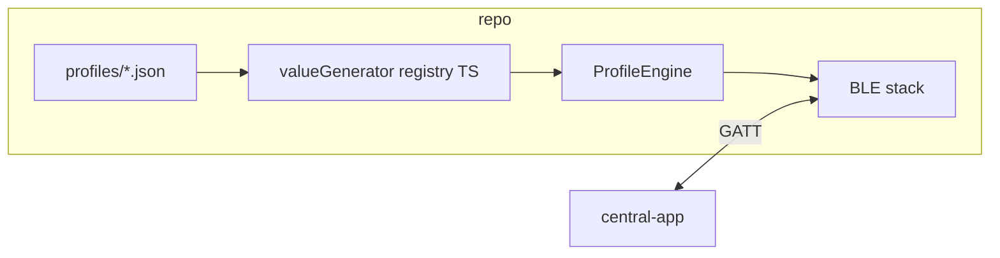

# Architecture

## Overview

This repository implements a **two-app BLE demo**:

| App | Role | Library | Typical device |
|-----|------|---------|----------------|
| `peripheral-app/` | GATT server + advertiser | `react-native-ble-peripheral-manager` | **Android** (peripheral mode) |
| `central-app/` | Scanner + GATT client | `react-native-ble-manager` | **iOS or Android** |

Behavior of the peripheral is driven by **JSON profiles** in `profiles/`. TypeScript maps optional `valueGenerator` keys to concrete simulation blocks before the shared **profile engine** runs (migrated from `react-native-ble-peripheral-manager` example branch `test-pripheral-config-profile-mar23`).

## Peripheral stack

1. **JSON profile** — device name, advertising, services/characteristics, optional state machine.
2. **`applyValueGenerators`** — expands `valueGenerator` strings into `simulation` / `stateOverrides` fragments understood by the engine.
3. **`ProfileEngine`** — registers services, handles read/write/notify, runs `SimulationRunner` and `StateMachineRunner` (subscribe/write/timer/manual transitions).
4. **`ProfileApp` UI** — profile selection, start/stop peripheral, dynamic controls from profile `ui` hints, log panel.

## Central stack

1. **`BleManager.start`** — initialize the native central manager.
2. **`scan`** — filter by primary service UUID aligned with the selected demo target (`src/centralTargets.ts`).
3. **`connect` → `retrieveServices` → `startNotification` / `write`** — interact with heart rate + battery or Nordic LBS characteristics.

## Design choices

- **Reuse first**: Core BLE profile logic is copied from the library example with minimal edits; behavior stays aligned with a known-good implementation.
- **Thin `valueGenerator` layer**: Avoids a heavy abstraction while keeping JSON readable and TS-owned tuning for simulations.
- **No shared JS package**: The two apps are independent React Native projects under one repo for clarity and simple `npm install` per app.
