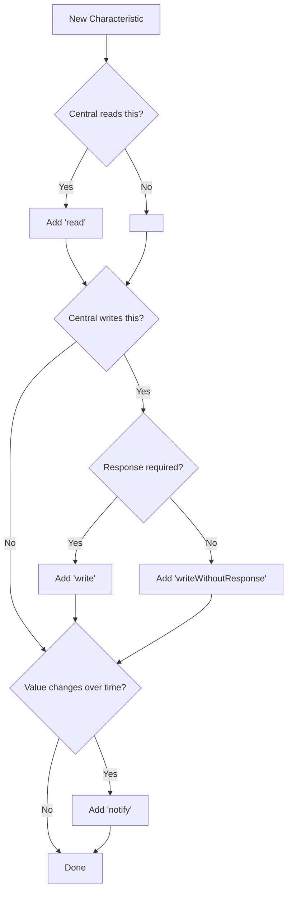
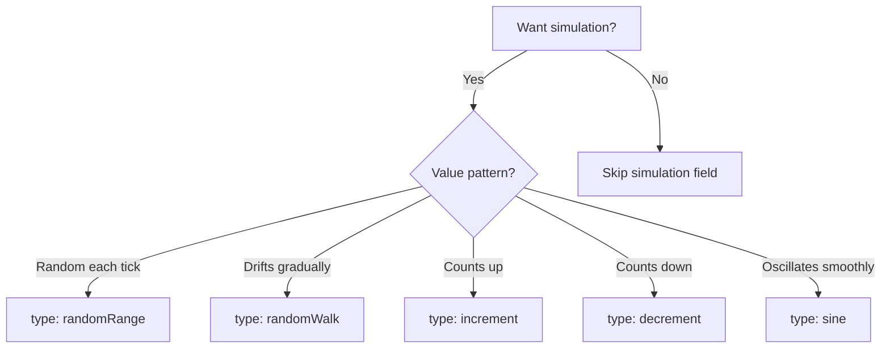
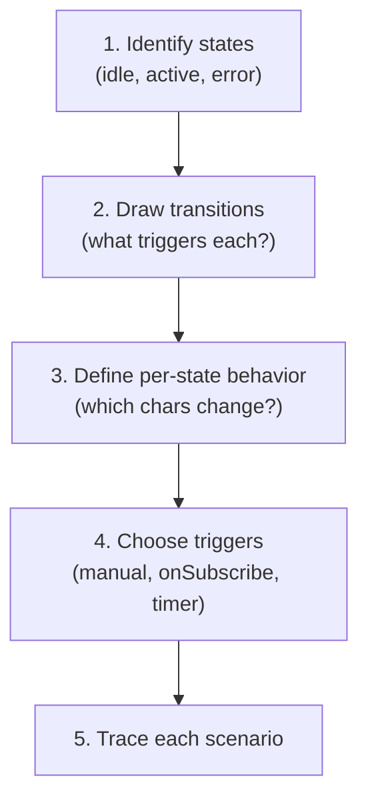

# Profile Authoring Guide

> Step-by-step tutorial to create a new BLE device profile from scratch.
> For field-level details, see [PROFILE_SCHEMA.md](./PROFILE_SCHEMA.md).

---

## Before You Start

You'll need:
- Knowledge of the BLE device you want to emulate (services, characteristics, UUIDs)
- A text editor for JSON
- The example app running to test your profile

---

## Step 1: Define Your Device

Start by answering these questions:

- What BLE services does your device expose?
- What are the UUIDs? (standard short UUIDs like `180D` or custom 128-bit)
- For each characteristic: Read? Write? Notify? What permissions?
- What values do characteristics hold? What encoding?
- Does the device have distinct behavioral states?

---

## Step 2: Create the JSON Skeleton

Create a file in `example/src/profiles/data/` (e.g. `my-device.json`):

```json
{
  "id": "my-device",
  "name": "My Custom Device",
  "description": "Short description for the profile picker",
  "advertising": {
    "localName": "MyDevice"
  },
  "services": []
}
```

---

## Step 3: Add Services and Characteristics

Use this decision tree for each characteristic:



Example service with two characteristics:

```json
{
  "uuid": "180D",
  "name": "Heart Rate",
  "characteristics": [
    {
      "uuid": "2A37",
      "name": "Heart Rate Measurement",
      "properties": ["notify"],
      "permissions": ["readable"],
      "value": { "type": "uint8Array", "initial": [0, 72] }
    },
    {
      "uuid": "2A38",
      "name": "Body Sensor Location",
      "properties": ["read"],
      "permissions": ["readable"],
      "value": { "type": "uint8", "initial": 1 }
    }
  ]
}
```

---

## Step 4: Add Device Information

Add the `deviceInfo` shorthand to auto-create a DIS service:

```json
{
  "deviceInfo": {
    "manufacturerName": "My Company",
    "modelNumber": "Model-001",
    "serialNumber": "SN-12345",
    "firmwareRevision": "1.0.0"
  }
}
```

---

## Step 5: Add Simulation (Optional)

Choose an algorithm:



Example: Heart rate random walk

```json
{
  "simulation": {
    "enabled": true,
    "type": "randomWalk",
    "intervalMs": 1000,
    "min": 60,
    "max": 120,
    "step": 2,
    "encoding": {
      "type": "uint8Array",
      "prefix": [0]
    }
  }
}
```

The `prefix: [0]` adds the Heart Rate Measurement flags byte before the BPM value.

---

## Step 6: Add UI Hints (Optional)

Tell the example app what control to render:

```json
{
  "ui": {
    "label": "Heart Rate",
    "unit": "BPM",
    "control": "stepper",
    "min": 40,
    "max": 200,
    "step": 1
  }
}
```

Control types:
- **`stepper`**: +/- buttons with value display (heart rate, temperature)
- **`slider`**: Bar with +/- buttons (battery level)
- **`toggle`**: On/off switch (button state)
- **`readonly`**: Display-only (values written by central)

---

## Step 7: Add State Machine (Optional)

Design your states:



Example state machine:

```json
{
  "stateMachine": {
    "initial": "idle",
    "states": {
      "idle": {
        "name": "Idle",
        "description": "Waiting for connection",
        "transitions": [
          { "to": "active", "trigger": { "type": "manual" }, "label": "Activate" }
        ]
      },
      "active": {
        "name": "Active",
        "description": "Fully operational",
        "transitions": [
          { "to": "idle", "trigger": { "type": "manual" }, "label": "Deactivate" }
        ]
      }
    }
  }
}
```

Add `stateOverrides` on characteristics to change behavior per state:

```json
{
  "stateOverrides": {
    "active": {
      "simulation": {
        "enabled": true,
        "type": "randomWalk",
        "intervalMs": 1000,
        "min": 60, "max": 120, "step": 2,
        "encoding": { "type": "uint8Array", "prefix": [0] }
      }
    },
    "idle": {
      "simulation": { "enabled": false, "type": "randomWalk", "intervalMs": 1000, "min": 0, "max": 0, "step": 0, "encoding": { "type": "uint8" } }
    }
  }
}
```

---

## Step 8: Add Write Handlers (Optional)

For writable characteristics:

```json
{
  "onWrite": {
    "action": "updateState",
    "stateKey": "ledState",
    "decode": "boolean"
  }
}
```

- `action: "log"` -- log the write value (debugging)
- `action: "updateState"` -- set a named state value the UI can observe

---

## Step 9: Register the Profile

Add your JSON to `profileRegistry.ts`:

```typescript
import myDevice from './data/my-device.json';

export const BUNDLED_PROFILES: BleProfile[] = [
  heartRate as unknown as BleProfile,
  lbs as unknown as BleProfile,
  myDevice as unknown as BleProfile,  // Add here
];
```

---

## Step 10: Test It

1. Run the example app
2. Select "Profile Mode"
3. Pick your profile from the list
4. Use nRF Connect on another device to inspect the GATT table
5. Verify services, characteristics, UUIDs, and properties match your design

---

## Profile JSON Checklist

Before shipping a profile, verify:

- [ ] `id` is unique among all profiles
- [ ] `name` and `description` are clear and descriptive
- [ ] `advertising.localName` is set (max ~28 chars for BLE)
- [ ] All `uuid` fields are correct (check BLE SIG assignments)
- [ ] `properties` arrays match what the real device exposes
- [ ] `permissions` match properties (read chars need `readable`, write chars need `writeable`)
- [ ] `value.type` and `value.initial` are compatible (number for uint8, array for uint8Array, etc.)
- [ ] Simulation `encoding` matches the characteristic's byte format
- [ ] State machine `initial` state exists in `states`
- [ ] All transition `to` targets are valid state IDs
- [ ] All `stateOverrides` keys match state machine state IDs
- [ ] Profile loads without validation errors

---

## Troubleshooting

| Problem | Likely Cause | Fix |
|---------|-------------|-----|
| "Unknown property" error | Typo in properties array | Check spelling: `read`, `write`, `writeWithoutResponse`, `notify`, `indicate` |
| "Unknown permission" error | Typo in permissions array | Check spelling: `readable`, `writeable`, `readEncryptionRequired`, `writeEncryptionRequired` |
| Profile not in picker | Not added to registry | Import in `profileRegistry.ts` and add to `BUNDLED_PROFILES` |
| Characteristic not readable | Missing `read` property | Add `"read"` to `properties` and `"readable"` to `permissions` |
| Notifications not working | Missing `notify` property | Add `"notify"` to `properties` |
| State overrides not applying | Key mismatch | Ensure `stateOverrides` keys exactly match state IDs in `stateMachine.states` |
| Simulation values wrong | Encoding mismatch | Check `encoding.prefix` / `encoding.suffix` match the characteristic format |
