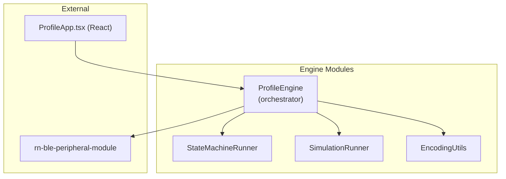
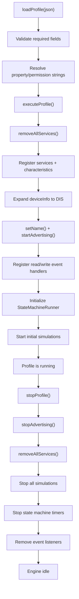
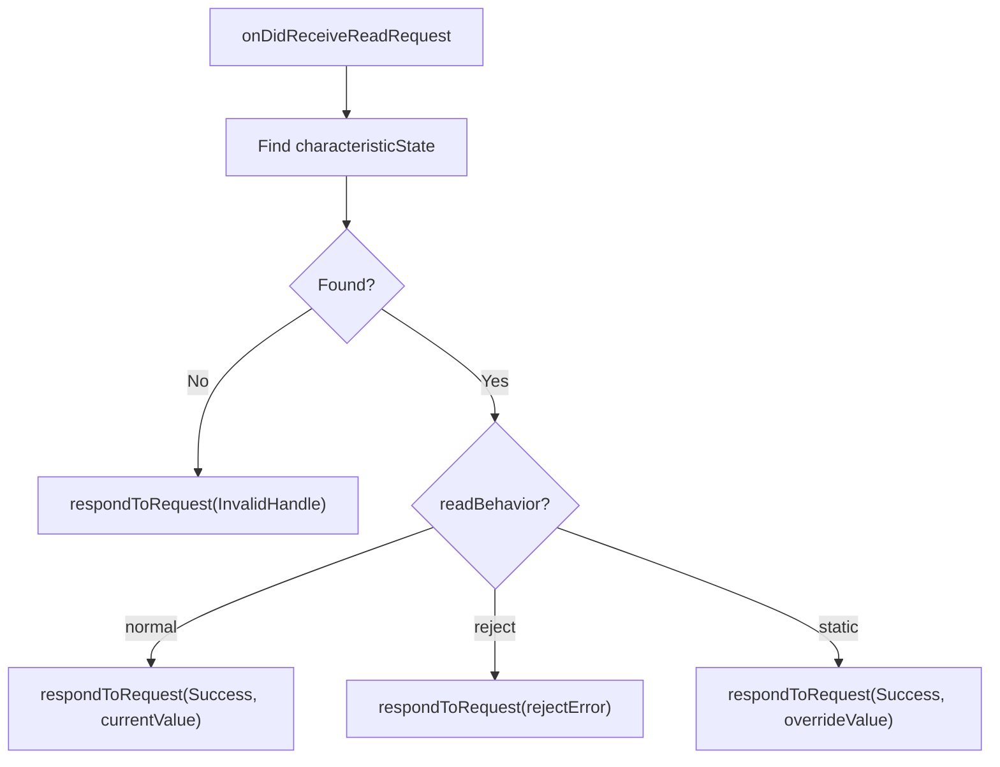
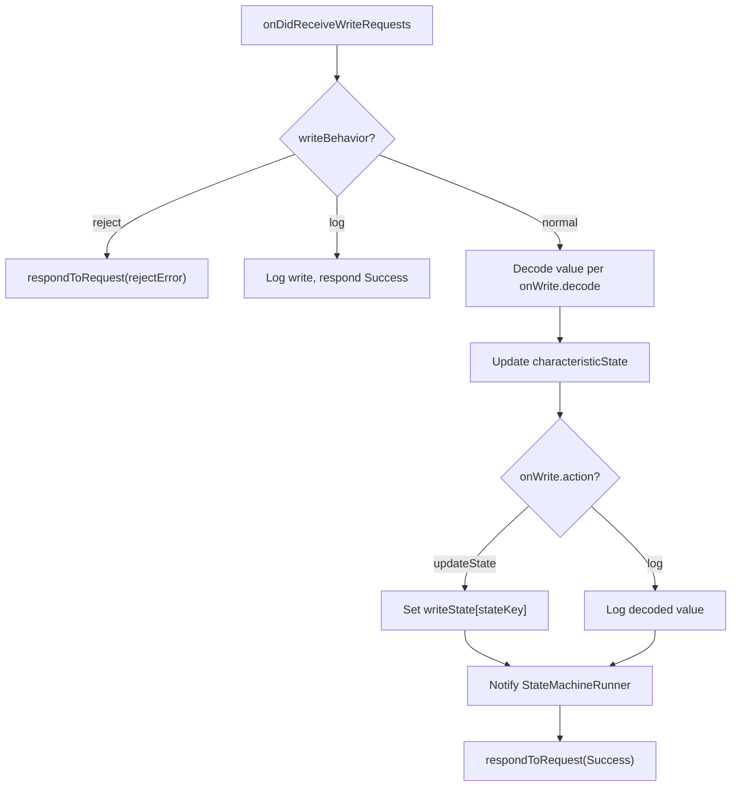
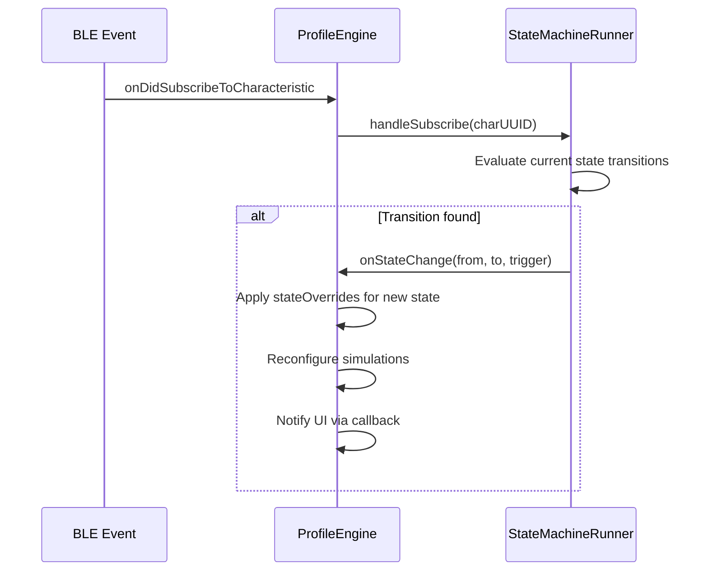
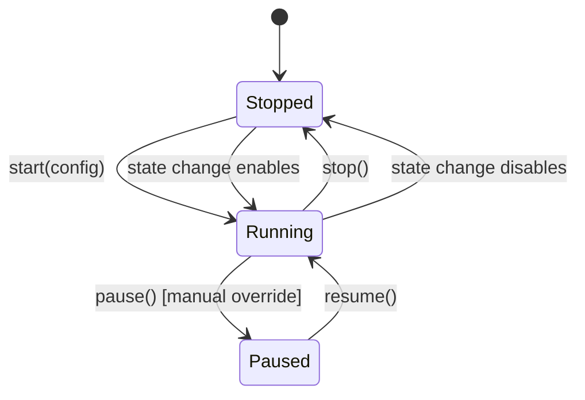
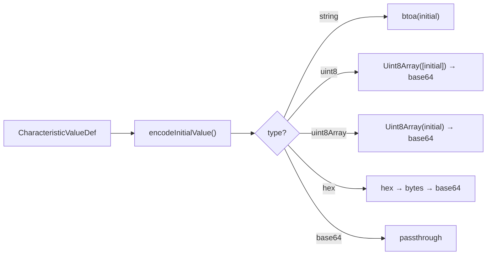

# Profile Engine Architecture Guide

> Deep dive into how the engine works internally.
> For profile JSON format, see [PROFILE_SCHEMA.md](./PROFILE_SCHEMA.md).

---

## 1. Overview

The Profile Engine is a **fully generic** runtime that reads any profile JSON and translates it into `rn-ble-peripheral-module` API calls. It contains zero profile-specific logic -- all behavior is driven by the JSON schema.



---

## 2. Module Responsibilities

| Module | File | Role |
|--------|------|------|
| **Types** | `types.ts` | All TypeScript interfaces, property/permission maps |
| **EncodingUtils** | `encodingUtils.ts` | Pure functions: value → base64 conversion |
| **SimulationRunner** | `simulationRunner.ts` | Timer management, value generation algorithms |
| **StateMachineRunner** | `stateMachineRunner.ts` | Current state, trigger evaluation, timer transitions |
| **ProfileEngine** | `profileEngine.ts` | Orchestrator: GATT setup, event handling, state integration |
| **ProfileRegistry** | `profileRegistry.ts` | Bundles JSON profiles, provides lookup |

**Dependency tree (critical for portability):**

```
types.ts              (leaf -- no local imports)
encodingUtils.ts      (leaf -- imports only types.ts)
simulationRunner.ts   (leaf -- imports types.ts + encodingUtils.ts)
stateMachineRunner.ts (leaf -- imports only types.ts)
profileEngine.ts      (orchestrator -- imports all above + library APIs)
profileRegistry.ts    (leaf -- imports types.ts + JSON data files)
```

---

## 3. Profile Lifecycle



---

## 4. GATT Registration Order

Characteristics must be added **before** their parent service:

```
for each service:
  for each characteristic:
    addCharacteristicToServiceBase64(svcUUID, charUUID, props, perms, value)
  addService(svcUUID, primary)
```

This is the correct order for CoreBluetooth (iOS). The engine standardises on this for both platforms.

---

## 5. Read Request Pipeline



---

## 6. Write Request Pipeline



---

## 7. State Machine Integration



### State Override Application

On state entry, for each characteristic:

1. Reset `readBehavior` and `writeBehavior` to `"normal"`
2. Check `stateOverrides[newStateId]`
3. If override exists:
   - Apply `readBehavior` / `writeBehavior` overrides
   - If `value` override exists, call `updateValue` immediately
   - If `simulation` override exists (and `enabled`), start it; otherwise stop existing simulation

---

## 8. Simulation Lifecycle



**Value generation algorithms:**

| Algorithm     | Behavior                                              |
|---------------|-------------------------------------------------------|
| `randomRange` | Each tick: `random(min, max)`                         |
| `randomWalk`  | Each tick: `clamp(current ± step, min, max)`          |
| `increment`   | Each tick: `current + step`, wraps at max             |
| `decrement`   | Each tick: `current - step`, wraps at min             |
| `sine`        | Smooth oscillation between min and max                |

---

## 9. Encoding Pipeline



For simulation ticks:

```
[...prefix, generatedValue, ...suffix] → Uint8Array → base64
```

---

## 10. Callback System

The engine communicates with the React layer via `ProfileEngineCallbacks`:

| Callback              | Fired When                               |
|-----------------------|------------------------------------------|
| `onLog`               | Any engine event worth logging           |
| `onValueChange`       | Characteristic value updates (sim or manual) |
| `onWriteStateChange`  | Central writes to a `updateState` char   |
| `onStateChange`       | State machine transitions                |
| `onAdvertisingChange` | Advertising starts/stops                 |

`ProfileApp.tsx` uses these to sync React state via `useState` hooks.

---

## 11. Cleanup and Teardown

`stopProfile()` cleans up in order:

1. Stop all simulations (`SimulationRunner.stopAll()`)
2. Stop state machine timers (`StateMachineRunner.stop()`)
3. Remove all event listener subscriptions
4. Call `stopAdvertising()` and `removeAllServices()`
5. Clear internal state maps

---

## 12. Error Handling

| Error Type | Handling |
|------------|----------|
| Profile validation | Throws descriptive `Error` with field name and valid options |
| BLE library errors | Caught and logged, don't crash the engine |
| Simulation errors | Per-timer catch, one failure doesn't stop others |
| Unknown ATT error | Throws with valid error names listed |
| Invalid state transitions | Logged as warning, not thrown |
