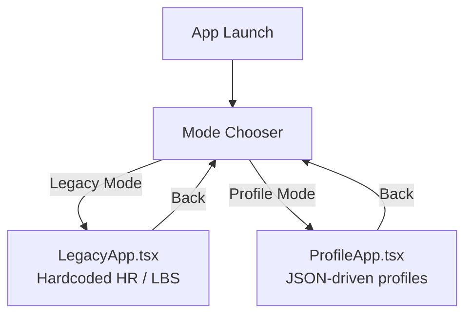
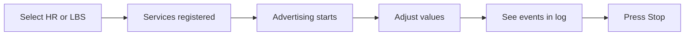
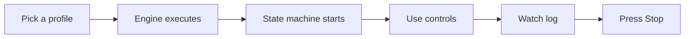
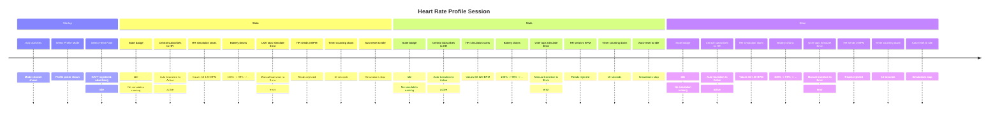

# Example App User Guide

> How to run, use, and test the BLE Peripheral Manager example app.

---

## 1. Overview

The example app demonstrates the `react-native-ble-peripheral-manager` library with two modes:

- **Legacy Mode**: Original hardcoded Heart Rate / LBS implementation
- **Profile Mode**: JSON-driven profile-based implementation with simulation and state machines



---

## 2. Prerequisites

- Node.js 18+
- React Native development environment configured
- A **physical device** (BLE peripheral mode does not work on simulators/emulators)
- A second BLE device with nRF Connect (or similar) for testing

### Platform-specific

- **iOS**: Xcode, CocoaPods
- **Android**: Android Studio, API 21+

---

## 3. Running the App

**iOS:**

```bash
cd example
npx pod-install
npx react-native run-ios
```

**Android:**

```bash
cd example
npx react-native run-android
```

### Permissions

- **iOS**: Bluetooth permission prompt appears automatically
- **Android 12+**: Runtime permissions for `BLUETOOTH_ADVERTISE` and `BLUETOOTH_CONNECT` are requested on first use

---

## 4. Mode Selection

On launch, you'll see two cards:

| Mode | Description |
|------|-------------|
| **Legacy Mode** | Hardcoded Heart Rate / LBS services -- the original implementation |
| **Profile Mode** | JSON-driven profiles with simulation, state machine, and dynamic controls |

Tap a card to enter that mode. Each mode has a "Back" button to return.

---

## 5. Legacy Mode



### Heart Rate

1. Tap "Heart Rate" to start the Heart Rate + Battery + DIS services
2. Use +/- buttons to change BPM (40-200 range)
3. Each change sends a notification to subscribed centrals
4. Heart Rate Measurement format: `[flags=0x00, bpmValue]`

### LBS (LED Button Service)

1. Tap "LBS" to start the LED Button + Battery + DIS services
2. Toggle the Button switch to send notifications (pressed/released)
3. LED state indicator shows when a central writes to the LED characteristic

### Battery

Common to both services. Use the slider buttons to set level (0-100%).

---

## 6. Profile Mode



### Profile Picker

Shows all bundled profiles with name and description. Tap to start.

### Dynamic Controls

Once a profile is running, the app renders controls based on the profile's `ui` hints:

- **Stepper**: +/- buttons with value display (Heart Rate BPM)
- **Slider**: Bar with increment buttons (Battery %)
- **Toggle**: On/off switch (Button state)
- **Readonly**: Display-only (LED state controlled by central)

### State Machine

When a profile has a state machine:

- **State badge**: Shows current state name and description
- **Transition buttons**: Manual transitions from the current state
- **Auto-transitions**: Timer and BLE event triggers happen automatically

---

## 7. State Machine in Action



---

## 8. Comparing Legacy vs Profile

To verify profile parity with legacy:

1. **Legacy test**: Select Legacy Mode → Start Heart Rate → On another device, scan with nRF Connect and inspect GATT table
2. **Stop**: Press Stop, go Back
3. **Profile test**: Select Profile Mode → Pick Heart Rate Monitor → On the other device, scan again
4. **Compare**: Both should show identical services, characteristics, UUIDs, properties, and permissions
5. **Extra**: Profile mode adds Body Sensor Location (0x2A38) and HR Control Point (0x2A39) not present in legacy

### What to check in nRF Connect

| Item | Should Match |
|------|-------------|
| Service UUIDs | `180D`, `180F`, `180A` |
| HR Measurement UUID | `2A37` with Notify property |
| Battery Level UUID | `2A19` with Read + Notify |
| DIS characteristic values | Same manufacturer, model, serial, etc. |
| Advertising name | `RN_BLE_HR_Demo` for HR, `My_LBS` for LBS |

---

## 9. Debug Log

The bottom panel shows real-time events:

| Log Type | Color | Meaning |
|----------|-------|---------|
| `info` | Gray | Informational messages |
| `success` | Green | Successful operations |
| `error` | Red | Errors and failures |
| `event` | Blue | BLE delegate callbacks |
| `native` | Purple | Native-level log messages |

Tap "Clear" to reset the log.

---

## 10. Troubleshooting

| Issue | Solution |
|-------|----------|
| Bluetooth off | Enable Bluetooth in device settings |
| Permissions denied | Go to app settings and grant Bluetooth permissions |
| Advertising fails | Check that no other app is advertising; restart Bluetooth |
| GATT table different | Ensure you stopped previous services before starting new ones |
| Simulator/emulator | BLE peripheral mode requires a physical device |
| Profile not loading | Check the debug log for validation errors |
