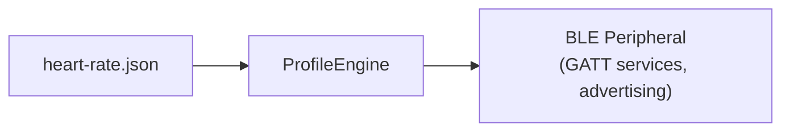
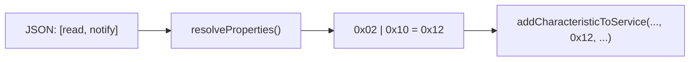
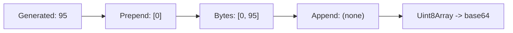
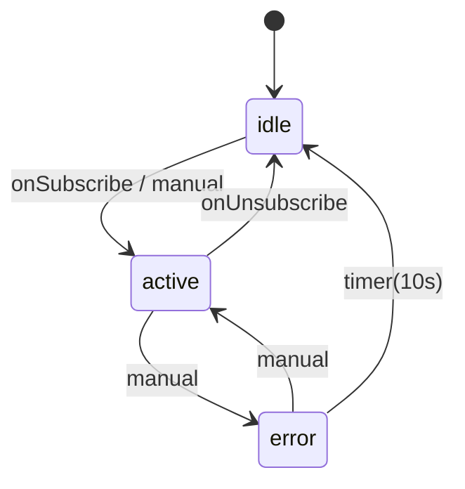

# Profile JSON Schema Reference

> Complete reference for the BLE Device Profile JSON format.
> Every field, type, default value, and encoding behavior is documented here.

---

## 1. Overview

A **profile** is a single JSON file that fully describes a BLE peripheral device to emulate. The [ProfileEngine](../profileEngine.ts) reads any valid profile JSON and translates it into `rn-ble-peripheral-module` API calls -- no profile-specific code required.



---

## 2. Quick Start -- Minimal Valid Profile

The smallest profile that the engine will accept:

```json
{
  "id": "minimal-device",
  "name": "Minimal Device",
  "advertising": { "localName": "MinDev" },
  "services": [
    {
      "uuid": "180F",
      "characteristics": [
        {
          "uuid": "2A19",
          "properties": ["read"],
          "permissions": ["readable"],
          "value": { "type": "uint8", "initial": 100 }
        }
      ]
    }
  ]
}
```

---

## 3. Top-Level Fields

| Field          | Type                  | Required | Default  | Description                                                         |
| -------------- | --------------------- | -------- | -------- | ------------------------------------------------------------------- |
| `id`           | `string`              | Yes      | --       | Unique machine-readable identifier (e.g. `"heart-rate-monitor"`)    |
| `name`         | `string`              | Yes      | --       | Human-readable display name                                         |
| `version`      | `string`              | No       | `"1.0"`  | Profile schema version for forward compatibility                    |
| `description`  | `string`              | No       | --       | One-line description shown in the profile picker                    |
| `advertising`  | `ProfileAdvertising`  | Yes      | --       | Advertising configuration ([section 4](#4-advertising))             |
| `deviceInfo`   | `ProfileDeviceInfo`   | No       | --       | Shorthand for Device Information Service ([section 5](#5-device-information-shorthand)) |
| `services`     | `ProfileService[]`    | Yes      | --       | GATT services to register ([section 6](#6-services))                |
| `stateMachine` | `ProfileStateMachine` | No       | --       | Optional state machine ([section 12](#12-state-machine))            |

---

## 4. Advertising

| Field          | Type       | Required | Default              | Description                                                |
| -------------- | ---------- | -------- | -------------------- | ---------------------------------------------------------- |
| `localName`    | `string`   | Yes      | --                   | Name included in advertising packets                       |
| `deviceName`   | `string`   | No       | Same as `localName`  | GAP device name set via `setName()`                        |
| `serviceUUIDs` | `string[]` | No       | Auto-derived         | UUIDs in advertising data. Auto-derived from all services if omitted |

---

## 5. Device Information Shorthand

If present, the engine auto-creates a Device Information Service (UUID `180A`) with read-only characteristics:

| Field              | DIS Char UUID | Default     |
| ------------------ | ------------- | ----------- |
| `manufacturerName` | `2A29`        | `"Unknown"` |
| `modelNumber`      | `2A24`        | `"Unknown"` |
| `serialNumber`     | `2A25`        | `"000000"`  |
| `hardwareRevision` | `2A27`        | `"1.0"`     |
| `firmwareRevision` | `2A26`        | `"1.0"`     |
| `softwareRevision` | `2A28`        | `"1.0"`     |

Each field becomes a characteristic with `properties: ["read"]`, `permissions: ["readable"]`.

---

## 6. Services

| Field             | Type                      | Required | Default | Description                       |
| ----------------- | ------------------------- | -------- | ------- | --------------------------------- |
| `uuid`            | `string`                  | Yes      | --      | Service UUID (short or 128-bit)   |
| `name`            | `string`                  | No       | --      | Human-readable name for logging   |
| `primary`         | `boolean`                 | No       | `true`  | Whether this is a primary service |
| `characteristics` | `ProfileCharacteristic[]` | Yes      | --      | Array of characteristics          |

---

## 7. Characteristics

| Field            | Type                                          | Required | Description                                |
| ---------------- | --------------------------------------------- | -------- | ------------------------------------------ |
| `uuid`           | `string`                                      | Yes      | Characteristic UUID                        |
| `name`           | `string`                                      | No       | Human-readable name                        |
| `properties`     | `CharPropertyName[]`                          | Yes      | Property strings ([section 8](#8-properties-and-permissions)) |
| `permissions`    | `CharPermissionName[]`                        | Yes      | Permission strings ([section 8](#8-properties-and-permissions)) |
| `value`          | `CharacteristicValueDef`                      | No       | Initial value ([section 9](#9-value-definitions)) |
| `simulation`     | `SimulationConfig`                            | No       | Auto-value generation ([section 10](#10-simulation)) |
| `ui`             | `UiHint`                                      | No       | UI control hint ([section 11](#11-ui-hints)) |
| `onWrite`        | `WriteAction`                                 | No       | Write handling ([section 11b](#11b-write-actions)) |
| `stateOverrides` | `Record<string, CharacteristicStateOverride>` | No       | Per-state overrides ([section 13](#13-state-overrides)) |

---

## 8. Properties and Permissions

Properties and permissions use human-readable strings. The engine resolves them to bitmasks:



**Properties:**

| String                   | Enum Value                                      | Hex    |
| ------------------------ | ----------------------------------------------- | ------ |
| `"read"`                 | `CharacteristicProperties.Read`                 | `0x02` |
| `"write"`                | `CharacteristicProperties.Write`                | `0x08` |
| `"writeWithoutResponse"` | `CharacteristicProperties.WriteWithoutResponse` | `0x04` |
| `"notify"`               | `CharacteristicProperties.Notify`               | `0x10` |
| `"indicate"`             | `CharacteristicProperties.Indicate`             | `0x20` |

**Permissions:**

| String                      | Enum Value                                          |
| --------------------------- | --------------------------------------------------- |
| `"readable"`                | `CharacteristicPermissions.Readable`                |
| `"writeable"`               | `CharacteristicPermissions.Writeable`               |
| `"readEncryptionRequired"`  | `CharacteristicPermissions.ReadEncryptionRequired`  |
| `"writeEncryptionRequired"` | `CharacteristicPermissions.WriteEncryptionRequired` |

---

## 9. Value Definitions

| Field     | Type                                                 | Required | Description           |
| --------- | ---------------------------------------------------- | -------- | --------------------- |
| `type`    | `"string"` \| `"uint8"` \| `"uint8Array"` \| `"hex"` \| `"base64"` | Yes | Encoding type |
| `initial` | `string` \| `number` \| `number[]`                   | Yes      | Initial value         |

**Encoding examples:**

```
type: "string"     initial: "Hello"     -> btoa("Hello")     -> "SGVsbG8="
type: "uint8"      initial: 72          -> Uint8Array([72])   -> "SA=="
type: "uint8Array" initial: [0, 72]     -> Uint8Array([0,72]) -> "AEg="
type: "hex"        initial: "0048"      -> bytes [0x00,0x48]  -> "AEg="
type: "base64"     initial: "AEg="      -> passthrough        -> "AEg="
```

---

## 10. Simulation

When present and `enabled: true`, a timer auto-generates values.

| Field        | Type               | Required | Default | Description                        |
| ------------ | ------------------ | -------- | ------- | ---------------------------------- |
| `enabled`    | `boolean`          | Yes      | --      | Whether simulation is active       |
| `type`       | `SimulationType`   | Yes      | --      | Algorithm (see below)              |
| `intervalMs` | `number`           | Yes      | --      | Milliseconds between updates       |
| `min`        | `number`           | Yes      | --      | Minimum value                      |
| `max`        | `number`           | Yes      | --      | Maximum value                      |
| `step`       | `number`           | No       | `1`     | Step size                          |
| `encoding`   | `SimulationEncoding` | Yes    | --      | How to encode the numeric value    |

**Algorithms:**

- **`randomRange`**: Each tick: `random(min, max)`
- **`randomWalk`**: Each tick: `clamp(current ± step, min, max)`
- **`increment`**: Each tick: `current + step` (wraps at max)
- **`decrement`**: Each tick: `current - step` (wraps at min)
- **`sine`**: Smooth oscillation between min and max

**SimulationEncoding:**

| Field    | Type       | Required | Description                                  |
| -------- | ---------- | -------- | -------------------------------------------- |
| `type`   | `"uint8"` \| `"uint8Array"` | Yes | Encoding type                    |
| `prefix` | `number[]` | No       | Bytes prepended before value (e.g. `[0]` for HR flags) |
| `suffix` | `number[]` | No       | Bytes appended after value                   |



---

## 11. UI Hints

| Field     | Type                                               | Required | Description                   |
| --------- | -------------------------------------------------- | -------- | ----------------------------- |
| `label`   | `string`                                           | Yes      | Display label                 |
| `unit`    | `string`                                           | No       | Unit suffix (e.g. "BPM", "%") |
| `control` | `"stepper"` \| `"slider"` \| `"toggle"` \| `"readonly"` | Yes | Control type            |
| `min`     | `number`                                           | No       | Min for stepper/slider        |
| `max`     | `number`                                           | No       | Max for stepper/slider        |
| `step`    | `number`                                           | No       | Step size (default `1`)       |

---

## 11b. Write Actions

| Field      | Type                                    | Required | Description                          |
| ---------- | --------------------------------------- | -------- | ------------------------------------ |
| `action`   | `"log"` \| `"updateState"`             | Yes      | What to do on write                  |
| `stateKey` | `string`                                | No       | For `"updateState"`: key name        |
| `decode`   | `"uint8"` \| `"string"` \| `"boolean"` | No       | How to decode the written value      |

---

## 12. State Machine

Optional top-level `stateMachine` field. When omitted, all characteristics use their base config.

| Field     | Type                              | Required | Description           |
| --------- | --------------------------------- | -------- | --------------------- |
| `initial` | `string`                          | Yes      | Starting state ID     |
| `states`  | `Record<string, StateDefinition>` | Yes      | Map of state ID -> definition |

**StateDefinition:**

| Field         | Type                | Required | Description                |
| ------------- | ------------------- | -------- | -------------------------- |
| `name`        | `string`            | Yes      | Human-readable state name  |
| `description` | `string`            | No       | Description for UI         |
| `transitions` | `StateTransition[]` | Yes      | Possible transitions       |

**StateTransition:**

| Field     | Type                | Required | Description                  |
| --------- | ------------------- | -------- | ---------------------------- |
| `to`      | `string`            | Yes      | Target state ID              |
| `trigger` | `TransitionTrigger` | Yes      | What triggers the transition |
| `label`   | `string`            | No       | Button label for manual triggers |

**Trigger types:**

| Type              | Fields                                | Description                 |
| ----------------- | ------------------------------------- | --------------------------- |
| `"manual"`        | --                                    | User button press           |
| `"onSubscribe"`   | `characteristicUUID?`                 | Central subscribes          |
| `"onUnsubscribe"` | `characteristicUUID?`                 | Central unsubscribes        |
| `"onWrite"`       | `characteristicUUID`, `value?`        | Central writes value        |
| `"timer"`         | `delayMs`                             | Auto-transition after delay |



---

## 13. State Overrides

Added as `stateOverrides` on characteristics. Keys are state IDs.

| Field           | Type                 | Description                               |
| --------------- | -------------------- | ----------------------------------------- |
| `simulation`    | `SimulationConfig`   | Override simulation for this state         |
| `value`         | `CharacteristicValueDef` | Set value on state entry              |
| `readBehavior`  | `"normal"` \| `"reject"` \| `"static"` | Read handling mode     |
| `writeBehavior` | `"normal"` \| `"reject"` \| `"log"`    | Write handling mode    |
| `rejectError`   | `string`             | ATT error name for reject mode            |

**Merge logic:** On state entry, the override replaces (not merges) the corresponding base config field.

---

## 14. Validation Rules

`loadProfile()` validates:

- `id`, `name`, `advertising.localName` are present
- At least one service with at least one characteristic
- All property/permission strings are valid
- State machine `initial` exists in `states`
- All transition `to` targets are valid state IDs
- All `stateOverrides` keys reference valid states

Invalid profiles throw descriptive errors listing what's wrong and valid options.
