# BLE Device Profile System -- Design Document

> **Living Document** -- This document is the single source of truth for the Profile system design.
> It is updated whenever the design, schema, or implementation changes.
> See the **Changelog** at the bottom for a history of all design revisions.

---

## 1. Terminology

- **Profile**: A JSON file that fully describes a BLE peripheral device to emulate (its advertised name, GATT services, characteristics, values, simulation behaviors, and state machine). Analogous to Bluetooth SIG "profiles" (Heart Rate Profile, HID Profile, etc.).
- **Profile Engine**: The **fully generic** runtime module that reads ANY profile JSON and translates it into `react-native-ble-peripheral-manager` API calls. Contains ZERO profile-specific logic.
- **State Machine**: An optional declarative definition of device states (e.g. `idle`, `active`, `error`, `charging`) with transitions triggered by BLE events or user actions. Characteristics can behave differently per state.
- **State Override**: Per-state configuration for a characteristic -- can override simulation, value, read/write behavior. Merged on top of the characteristic's base config when the state machine enters that state.
- **Simulation**: Optional automatic value generation for a characteristic (e.g. heart rate fluctuating, battery draining) driven by timers. State-aware: can be enabled/disabled/reconfigured per state.
- **UI Hint**: Metadata in the profile that tells the example app how to render a control for a characteristic (stepper, slider, toggle, readonly display).
- **Transition Trigger**: The event that causes the state machine to move from one state to another (e.g. `manual`, `onSubscribe`, `onWrite`, `timer`).

---

## 2. Architecture Overview

The profile system is a **declarative-to-imperative translation layer** between JSON profile definitions and the native BLE peripheral library.

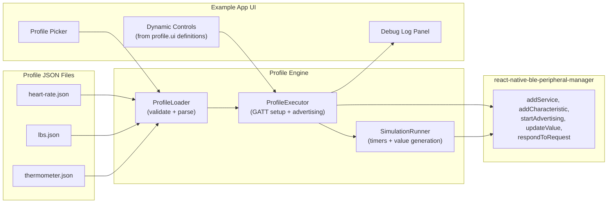


**Location**: All profile code lives in `example/src/profiles/` with zero dependencies on example app internals. This isolation makes future extraction into a standalone package or cloud-hosted solution straightforward.

### 2.1 Generic Engine Principle (CRITICAL)

The ProfileEngine, SimulationRunner, StateMachineRunner, and all supporting code must be **100% generic**. This means:

- **NO** `if (profileId === 'heart-rate')` or `switch(serviceUUID)` anywhere
- **NO** hardcoded UUIDs, service names, or characteristic names in engine code
- **NO** profile-specific logic -- ALL behavior comes from the JSON schema
- The engine iterates over `profile.services`, `profile.services[].characteristics`, `profile.stateMachine.states`, etc. and acts on them generically
- A brand-new profile JSON (e.g. `blood-pressure.json` or `custom-sensor.json`) should work without changing a single line of engine code
- The only code that references specific profile IDs is `profileRegistry.ts` (the import list) and the JSON files themselves

**Test for genericness**: If you can delete all `.json` profile files, replace them with a completely different device profile, and the engine still works correctly without code changes -- the engine is properly generic.

### 2.2 Code Quality Standards

All code in the profile system must follow these standards:

**Clean TypeScript**:

- Strict types everywhere -- no `any` unless absolutely unavoidable (and documented why)
- All exported functions, classes, and interfaces have JSDoc comments explaining purpose, params, and return values
- Use `readonly` where appropriate to prevent accidental mutation
- Prefer named exports over default exports for better refactoring/IDE support
- Use union types and discriminated unions instead of stringly-typed APIs

**Readability**:

- Self-documenting function/variable names -- avoid abbreviations (e.g. `characteristicState` not `charSt`)
- Each function does one thing. If a function exceeds ~40 lines, consider extracting helper functions
- Avoid deep nesting (>3 levels) -- use early returns, extracted functions, or `Map` lookups instead
- Group related code with section comments (e.g. `// ── Public API ──`) when files have multiple logical sections
- No clever one-liners -- clarity over brevity

**Organization -- Right-Sized Modules**:

- Each file has a single clear responsibility (types, encoding, simulation, state machine, engine, registry)
- NOT overly granular -- don't split a 50-line utility into 3 files
- The `profiles/` folder is self-contained with zero imports from `example/src/` (except shared types like `LogEntry`)
- Internal modules (`encodingUtils`, `simulationRunner`, `stateMachineRunner`) have no dependencies on each other -- they only depend on `types.ts`
- Only `profileEngine.ts` orchestrates the other modules
- This dependency tree ensures any module can be moved to a separate package with minimal effort:

```
types.ts           (leaf -- no local imports)
encodingUtils.ts   (leaf -- imports only types.ts)
simulationRunner.ts (leaf -- imports types.ts + encodingUtils.ts)
stateMachineRunner.ts (leaf -- imports only types.ts)
profileEngine.ts   (orchestrator -- imports all above + library APIs)
profileRegistry.ts (leaf -- imports types.ts + JSON data files)
```

**Portability / Easy to Move**:

- All profile code in `example/src/profiles/` -- never scattered across the example app
- Engine and runners have NO React dependency -- pure TypeScript classes/functions
- Only `ProfileApp.tsx` (React component, outside `profiles/`) has React imports
- `profileRegistry.ts` is the ONLY file that imports specific JSON profile files -- everything else is generic
- If extracting to a package: move `profiles/` folder, add `package.json`, done

### 2.3 Testing Strategy

Tests will be written AFTER the main code logic is finalized and manually tested. The approach:

**Phase 1 (NOW)**: Build all code, test manually via the example app (Legacy vs Profile mode comparison with nRF Connect).

**Phase 2 (LATER)**: Add automated tests covering:

- `**encodingUtils.ts`** -- Unit tests for each encoding function (string, uint8, uint8Array, hex, base64, simulation encoding). Pure functions, easy to test.
- `**simulationRunner.ts`** -- Unit tests for each algorithm (randomRange, randomWalk, increment, decrement, sine). Test start/stop/pause/resume lifecycle. Use fake timers.
- `**stateMachineRunner.ts`** -- Unit tests for trigger evaluation (manual, onSubscribe, onUnsubscribe, onWrite, timer). Test state transitions, timer cleanup, validation errors. Use fake timers.
- `**profileEngine.ts`** -- Integration tests mocking the BLE library (`addService`, `updateValue`, etc.). Test full lifecycle: load -> execute -> read/write handling -> state changes -> stop.
- `**types.ts`** -- Unit tests for `resolveProperties()`, `resolvePermissions()`, `resolveATTError()` mappers including error cases.
- **Profile JSON validation** -- Test `loadProfile()` with valid profiles, missing fields, invalid property names, invalid state machine references.

Test files will live alongside source files (e.g. `encodingUtils.test.ts`) or in a `__tests__/` subfolder within `profiles/`.

---

## 3. File Structure

```
example/src/
  App.tsx                     # Mode chooser: Legacy vs Profile (entry point)
  LegacyApp.tsx               # Current hardcoded service logic (moved from App.tsx, untouched)
  ProfileApp.tsx              # Profile-based UI: picker, dynamic controls, simulation toggle
  profiles/
    types.ts                  # All TypeScript interfaces for the profile JSON schema
    profileEngine.ts          # Core engine: load, execute, stop, update, read/write handlers (GENERIC)
    stateMachineRunner.ts     # State machine: current state, transitions, state-override application
    simulationRunner.ts       # Timer-based dynamic value generation (state-aware)
    profileRegistry.ts        # Registry of bundled profiles (imports JSONs, exports typed list)
    encodingUtils.ts          # Value encoding helpers (uint8, string, hex -> base64)
    data/
      heart-rate.json         # Heart Rate Monitor profile (with state machine)
      lbs.json                # LED Button Service profile (with state machine)
    docs/
      profiles-system-plan.md # Full design plan (persisted in repo for future sessions)
      PROFILE_SCHEMA.md       # Complete JSON schema reference
      ENGINE_GUIDE.md         # Architecture, data flows, state machine internals
      AUTHORING_GUIDE.md      # Step-by-step guide to create new profiles
      EXAMPLE_APP_README.md   # How to run, test, and compare legacy vs profile mode
  constants/                  # (existing, unchanged -- used by LegacyApp.tsx)
    bleUuids.ts
    bleCharacteristicFlags.ts
  components/                 # (existing, shared by both modes)
    DebugLogPanel.tsx
    ActionButton.tsx
    LogItemRow.tsx
  styles/
    appStyles.ts              # (existing, shared)
  types/
    log.ts                    # (existing, shared)
```

---

## 4. Profile JSON Schema -- Complete Specification

A profile is a single JSON file. Every field is documented below with its type, whether it is required/optional, and its purpose.

### 4.1 Top-Level Structure


| Field         | Type                 | Required | Description                                                                                      |
| ------------- | -------------------- | -------- | ------------------------------------------------------------------------------------------------ |
| `id`          | `string`             | Yes      | Unique machine-readable identifier (e.g. `"heart-rate-monitor"`)                                 |
| `name`        | `string`             | Yes      | Human-readable display name (e.g. `"Heart Rate Monitor"`)                                        |
| `version`     | `string`             | No       | Profile schema version for forward compatibility (default `"1.0"`)                               |
| `description` | `string`             | No       | One-line description shown in the profile picker                                                 |
| `advertising` | `ProfileAdvertising` | Yes      | Advertising configuration (see 4.2)                                                              |
| `deviceInfo`  | `ProfileDeviceInfo`  | No       | Shorthand for Device Information Service 0x180A (see 4.3). Engine auto-expands to a full service |
| `services`    | `ProfileService[]`   | Yes      | Array of GATT services to register (see 4.4)                                                     |


### 4.2 `ProfileAdvertising`


| Field          | Type       | Required | Description                                                                                       |
| -------------- | ---------- | -------- | ------------------------------------------------------------------------------------------------- |
| `localName`    | `string`   | Yes      | The name included in advertising packets (passed to `startAdvertising({ localName })`)            |
| `deviceName`   | `string`   | No       | The GAP device name (passed to `setName()`). Defaults to `localName` if omitted                   |
| `serviceUUIDs` | `string[]` | No       | UUIDs to include in advertising data. If omitted, auto-derived from all `services[].uuid` entries |


### 4.3 `ProfileDeviceInfo` (Shorthand for DIS 0x180A)

If present, the engine auto-creates a Device Information Service with these read-only characteristics. All fields are optional strings.


| Field              | DIS Characteristic UUID | Default     |
| ------------------ | ----------------------- | ----------- |
| `manufacturerName` | `2A29`                  | `"Unknown"` |
| `modelNumber`      | `2A24`                  | `"Unknown"` |
| `serialNumber`     | `2A25`                  | `"000000"`  |
| `hardwareRevision` | `2A27`                  | `"1.0"`     |
| `firmwareRevision` | `2A26`                  | `"1.0"`     |
| `softwareRevision` | `2A28`                  | `"1.0"`     |


Each field becomes a characteristic with `properties: ["read"]`, `permissions: ["readable"]`, and the string value base64-encoded.

### 4.4 `ProfileService`


| Field             | Type                      | Required | Description                                              |
| ----------------- | ------------------------- | -------- | -------------------------------------------------------- |
| `uuid`            | `string`                  | Yes      | Service UUID (short `"180D"` or full 128-bit)            |
| `name`            | `string`                  | No       | Human-readable name for logging/UI (e.g. `"Heart Rate"`) |
| `primary`         | `boolean`                 | No       | Whether this is a primary service (default `true`)       |
| `characteristics` | `ProfileCharacteristic[]` | Yes      | Characteristics belonging to this service                |


### 4.5 `ProfileCharacteristic`


| Field         | Type                     | Required | Description                                                      |
| ------------- | ------------------------ | -------- | ---------------------------------------------------------------- |
| `uuid`        | `string`                 | Yes      | Characteristic UUID                                              |
| `name`        | `string`                 | No       | Human-readable name for logging/UI                               |
| `properties`  | `CharPropertyName[]`     | Yes      | Array of property strings (see 4.6)                              |
| `permissions` | `CharPermissionName[]`   | Yes      | Array of permission strings (see 4.6)                            |
| `value`       | `CharacteristicValueDef` | No       | Initial value definition (see 4.7)                               |
| `simulation`  | `SimulationConfig`       | No       | Auto-value-generation config (see 4.8)                           |
| `ui`          | `UiHint`                 | No       | UI control hint for the example app (see 4.9)                    |
| `onWrite`     | `WriteAction`            | No       | Behavior when a central writes to this characteristic (see 4.10) |


### 4.6 Property and Permission String Mappings

Profiles use human-readable strings. The engine maps them to bitmask values from `CharacteristicProperties` and `CharacteristicPermissions` enums.

**Properties** (combined with bitwise OR):


| String                   | Enum Value                                      | Hex    |
| ------------------------ | ----------------------------------------------- | ------ |
| `"read"`                 | `CharacteristicProperties.Read`                 | `0x02` |
| `"write"`                | `CharacteristicProperties.Write`                | `0x08` |
| `"writeWithoutResponse"` | `CharacteristicProperties.WriteWithoutResponse` | `0x04` |
| `"notify"`               | `CharacteristicProperties.Notify`               | `0x10` |
| `"indicate"`             | `CharacteristicProperties.Indicate`             | `0x20` |


**Permissions** (combined with bitwise OR):


| String                      | Enum Value                                          |
| --------------------------- | --------------------------------------------------- |
| `"readable"`                | `CharacteristicPermissions.Readable`                |
| `"writeable"`               | `CharacteristicPermissions.Writeable`               |
| `"readEncryptionRequired"`  | `CharacteristicPermissions.ReadEncryptionRequired`  |
| `"writeEncryptionRequired"` | `CharacteristicPermissions.WriteEncryptionRequired` |


### 4.7 `CharacteristicValueDef`

Defines the initial value for a characteristic and how to encode it.


| Field     | Type       | Required  | Description    |
| --------- | ---------- | --------- | -------------- |
| `type`    | `"string"` | `"uint8"` | `"uint8Array"` |
| `initial` | `string`   | `number`  | `number[]`     |


**Type-to-initial mapping**:

- `"string"` -> `initial` is a plain string (e.g. `"Demo Manufacturer"`). Engine calls `btoa(initial)`
- `"uint8"` -> `initial` is a single number 0-255 (e.g. `100`). Engine encodes as `Uint8Array([initial])` -> base64
- `"uint8Array"` -> `initial` is an array of numbers (e.g. `[0, 72]`). Engine encodes as `Uint8Array(initial)` -> base64
- `"hex"` -> `initial` is a hex string (e.g. `"0048"`). Engine decodes hex -> bytes -> base64
- `"base64"` -> `initial` is already base64-encoded. Engine passes through as-is

### 4.8 `SimulationConfig`

Optional. When present and `enabled: true`, the engine runs a timer that auto-generates new values.


| Field        | Type                 | Required | Description                                          |
| ------------ | -------------------- | -------- | ---------------------------------------------------- |
| `enabled`    | `boolean`            | Yes      | Whether simulation is active on profile load         |
| `type`       | `SimulationType`     | Yes      | Algorithm: `"randomRange"`                           |
| `intervalMs` | `number`             | Yes      | Milliseconds between value updates                   |
| `min`        | `number`             | Yes      | Minimum value (inclusive)                            |
| `max`        | `number`             | Yes      | Maximum value (inclusive)                            |
| `step`       | `number`             | No       | Step size for walk/increment/decrement (default `1`) |
| `encoding`   | `SimulationEncoding` | Yes      | How to encode the generated numeric value into bytes |


`**SimulationEncoding`**:


| Field    | Type       | Required       | Description                                                                |
| -------- | ---------- | -------------- | -------------------------------------------------------------------------- |
| `type`   | `"uint8"`  | `"uint8Array"` | Yes                                                                        |
| `prefix` | `number[]` | No             | Bytes to prepend before the simulated value (e.g. `[0]` for HR flags byte) |
| `suffix` | `number[]` | No             | Bytes to append after the simulated value                                  |


**Simulation algorithm details**:

- `**randomRange`**: Each tick: `value = random(min, max)`
- `**randomWalk`**: Each tick: `value = clamp(current + randomSign * step, min, max)`
- `**increment`**: Each tick: `value += step`; if `value > max`, wrap to `min`
- `**decrement`**: Each tick: `value -= step`; if `value < min`, wrap to `max`
- `**sine`**: Each tick: `value = mid + amplitude * sin(tick * frequency)` where `mid = (min+max)/2`, `amplitude = (max-min)/2`

### 4.9 `UiHint`

Optional. Tells the example app what control to render for this characteristic. The app is fully data-driven by these hints.


| Field     | Type        | Required   | Description                                |
| --------- | ----------- | ---------- | ------------------------------------------ |
| `label`   | `string`    | Yes        | Display label (e.g. `"Heart Rate"`)        |
| `unit`    | `string`    | No         | Unit suffix (e.g. `"BPM"`, `"%"`, `"C"`)   |
| `control` | `"stepper"` | `"slider"` | `"toggle"`                                 |
| `min`     | `number`    | No         | Minimum value for stepper/slider           |
| `max`     | `number`    | No         | Maximum value for stepper/slider           |
| `step`    | `number`    | No         | Step size for stepper/slider (default `1`) |


**Control type behavior**:

- `**stepper`**: +/- buttons with current value display (used for heart rate, temperature)
- `**slider`**: Draggable slider with min/max (used for battery level)
- `**toggle`**: On/off switch (used for button state, LED)
- `**readonly`**: Display-only, shows current value (used for write-only chars controlled by central)

### 4.10 `WriteAction`

Optional. Defines what happens when a central writes to this characteristic.


| Field      | Type      | Required        | Description                                                                               |
| ---------- | --------- | --------------- | ----------------------------------------------------------------------------------------- |
| `action`   | `"log"`   | `"updateState"` | Yes                                                                                       |
| `stateKey` | `string`  | No              | For `"updateState"`: key name to update in the engine's runtime state (e.g. `"ledState"`) |
| `decode`   | `"uint8"` | `"string"`      | `"boolean"`                                                                               |


### 4.11 `ProfileStateMachine`

Optional top-level field. When present, the profile has a state machine that governs device behavior. If omitted, the profile runs in a single implicit state (backward compatible -- all characteristics use their base config at all times).


| Field     | Type                              | Required | Description                                     |
| --------- | --------------------------------- | -------- | ----------------------------------------------- |
| `initial` | `string`                          | Yes      | ID of the initial state when the profile starts |
| `states`  | `Record<string, StateDefinition>` | Yes      | Map of state ID -> state definition             |


Example:

```json
{
  "stateMachine": {
    "initial": "idle",
    "states": {
      "idle": { ... },
      "active": { ... },
      "error": { ... }
    }
  }
}
```

### 4.12 `StateDefinition`


| Field         | Type                | Required | Description                                                       |
| ------------- | ------------------- | -------- | ----------------------------------------------------------------- |
| `name`        | `string`            | Yes      | Human-readable name shown in UI (e.g. `"Active"`)                 |
| `description` | `string`            | No       | Description shown in UI (e.g. `"Actively monitoring heart rate"`) |
| `transitions` | `StateTransition[]` | Yes      | Array of possible transitions from this state                     |


### 4.13 `StateTransition`


| Field     | Type                | Required | Description                                                    |
| --------- | ------------------- | -------- | -------------------------------------------------------------- |
| `to`      | `string`            | Yes      | Target state ID to transition to                               |
| `trigger` | `TransitionTrigger` | Yes      | What event causes this transition (see below)                  |
| `label`   | `string`            | No       | Button label for `manual` triggers (e.g. `"Start Monitoring"`) |


`**TransitionTrigger**` -- one of:


| Trigger Type      | Format                                                            | Description                                                                                                                                       |
| ----------------- | ----------------------------------------------------------------- | ------------------------------------------------------------------------------------------------------------------------------------------------- |
| `"manual"`        | `{ "type": "manual" }`                                            | User presses a button in the UI. The button label comes from `transition.label`.                                                                  |
| `"onSubscribe"`   | `{ "type": "onSubscribe", "characteristicUUID?": "..." }`         | Central subscribes to a characteristic. If `characteristicUUID` is specified, only triggers on that char; otherwise triggers on any subscription. |
| `"onUnsubscribe"` | `{ "type": "onUnsubscribe", "characteristicUUID?": "..." }`       | Central unsubscribes. Same UUID filtering as above.                                                                                               |
| `"onWrite"`       | `{ "type": "onWrite", "characteristicUUID": "...", "value?": 1 }` | Central writes to a characteristic. If `value` is specified, only triggers when the decoded value matches.                                        |
| `"timer"`         | `{ "type": "timer", "delayMs": 5000 }`                            | Auto-transitions after `delayMs` milliseconds in this state.                                                                                      |


**Trigger evaluation order**: When a BLE event occurs, the engine checks the current state's transitions in array order. The **first** matching transition fires. This allows priority ordering.

### 4.14 `CharacteristicStateOverride`

Added as an optional `stateOverrides` field on `ProfileCharacteristic` (section 4.5). This is a `Record<stateId, override>` where each override can selectively replace parts of the characteristic's behavior for that state.


| Field           | Type                     | Required   | Description                                                                                     |
| --------------- | ------------------------ | ---------- | ----------------------------------------------------------------------------------------------- |
| `simulation`    | `SimulationConfig`       | No         | Override simulation config for this state (replaces base simulation entirely)                   |
| `value`         | `CharacteristicValueDef` | No         | Override value when entering this state (engine calls `updateValue`)                            |
| `readBehavior`  | `"normal"`               | `"reject"` | `"static"`                                                                                      |
| `writeBehavior` | `"normal"`               | `"reject"` | `"log"`                                                                                         |
| `rejectError`   | `string`                 | No         | ATT error name for `"reject"` behaviors (default `"ReadNotPermitted"` or `"WriteNotPermitted"`) |


**Read/Write behavior modes**:

- `"normal"`: Default. Reads return current value, writes update state per `onWrite` config.
- `"reject"`: Read/write requests are rejected with the specified ATT error code.
- `"static"`: (Read only) Always returns the `value` defined in this override, ignoring simulation/current state.
- `"log"`: (Write only) Accepts the write, logs it, but does NOT update state or trigger transitions.

**State override merge logic**: When the state machine enters a state, for each characteristic:

1. Start with the characteristic's base config (from `ProfileCharacteristic`)
2. If `stateOverrides[currentStateId]` exists, apply it:
  - `simulation`: replaces base simulation entirely (not merged field-by-field)
  - `value`: engine calls `updateValue` with this value immediately on state entry
  - `readBehavior` / `writeBehavior`: override for the duration of this state
3. If no override exists for the current state, the base config is used as-is

### 4.15 Updated `ProfileCharacteristic` (with state overrides)

The characteristic schema from section 4.5, now with the `stateOverrides` field:


| Field            | Type                                          | Required | Description                                                                                           |
| ---------------- | --------------------------------------------- | -------- | ----------------------------------------------------------------------------------------------------- |
| `uuid`           | `string`                                      | Yes      | Characteristic UUID                                                                                   |
| `name`           | `string`                                      | No       | Human-readable name for logging/UI                                                                    |
| `properties`     | `CharPropertyName[]`                          | Yes      | Array of property strings (see 4.6)                                                                   |
| `permissions`    | `CharPermissionName[]`                        | Yes      | Array of permission strings (see 4.6)                                                                 |
| `value`          | `CharacteristicValueDef`                      | No       | Initial value definition (see 4.7)                                                                    |
| `simulation`     | `SimulationConfig`                            | No       | Base simulation config (see 4.8). Used when no state override applies.                                |
| `ui`             | `UiHint`                                      | No       | UI control hint for the example app (see 4.9)                                                         |
| `onWrite`        | `WriteAction`                                 | No       | Behavior when a central writes (see 4.10)                                                             |
| `stateOverrides` | `Record<string, CharacteristicStateOverride>` | No       | Per-state behavior overrides (see 4.14). Keys are state IDs from the profile's `stateMachine.states`. |


**Backward compatibility**: If a profile has no `stateMachine` field, `stateOverrides` is ignored even if present. The characteristic always uses its base config.

### 4.16 Updated Top-Level Structure (with state machine)


| Field          | Type                  | Required | Description                                                         |
| -------------- | --------------------- | -------- | ------------------------------------------------------------------- |
| `id`           | `string`              | Yes      | Unique machine-readable identifier                                  |
| `name`         | `string`              | Yes      | Human-readable display name                                         |
| `version`      | `string`              | No       | Profile schema version (default `"1.0"`)                            |
| `description`  | `string`              | No       | One-line description shown in profile picker                        |
| `advertising`  | `ProfileAdvertising`  | Yes      | Advertising configuration (see 4.2)                                 |
| `deviceInfo`   | `ProfileDeviceInfo`   | No       | Shorthand for DIS 0x180A (see 4.3)                                  |
| `services`     | `ProfileService[]`    | Yes      | GATT services to register (see 4.4)                                 |
| `stateMachine` | `ProfileStateMachine` | No       | Optional state machine (see 4.11). If omitted, no state management. |


---

## 5. Legacy-to-Profile Parity Matrix

The profile-based implementation must produce **identical GATT tables and advertising** as the legacy hardcoded implementation, so BLE centrals see the exact same device. This section documents the exact mapping.

### 5.1 Legacy Heart Rate -- GATT Breakdown

What the legacy `handleStartHeartRate()` in `App.tsx` registers:

**Service 1: Heart Rate (0x180D) -- primary**


| Characteristic         | UUID   | Properties    | Permissions | Initial Value | Legacy Code                                          |
| ---------------------- | ------ | ------------- | ----------- | ------------- | ---------------------------------------------------- |
| Heart Rate Measurement | `2A37` | Notify (0x10) | Readable    | `""` (empty)  | Updated via `updateValue()` with `[0x00, bpm]` bytes |


**Service 2: Battery (0x180F) -- primary**


| Characteristic | UUID   | Properties | Permissions   | Initial Value | Legacy Code  |
| -------------- | ------ | ---------- | ------------- | ------------- | ------------ |
| Battery Level  | `2A19` | Read       | Notify (0x12) | Readable      | `""` (empty) |


**Service 3: Device Information (0x180A) -- primary**


| Characteristic    | UUID   | Properties  | Permissions | Initial Value                   |
| ----------------- | ------ | ----------- | ----------- | ------------------------------- |
| Manufacturer Name | `2A29` | Read (0x02) | Readable    | `btoa("Demo Manufacturer")`     |
| Model Number      | `2A24` | Read (0x02) | Readable    | `btoa("RN-BLE-Peripheral-001")` |
| Serial Number     | `2A25` | Read (0x02) | Readable    | `btoa("DEMO-2024-001234")`      |
| Hardware Revision | `2A27` | Read (0x02) | Readable    | `btoa("1.0.0")`                 |
| Firmware Revision | `2A26` | Read (0x02) | Readable    | `btoa("2.1.0")`                 |
| Software Revision | `2A28` | Read (0x02) | Readable    | `btoa("1.0.0")`                 |


**Advertising**: `localName = "RN_BLE_HR_Demo"`, `deviceName = "My_HR"`, `serviceUUIDs = ["180D", "180F", "180A"]`

**Read handler**: All read requests respond with `"Hello BLE"` (constant `DEFAULT_CHARACTERISTIC_READ_VALUE`).

**Value update format**:

- Heart Rate: `Uint8Array([0x00, bpm])` -> base64 (flags byte + uint8 BPM)
- Battery: `Uint8Array([level])` -> base64 (single uint8 0-100)

### 5.2 Legacy LBS -- GATT Breakdown

What the legacy `handleStartLBS()` in `App.tsx` registers:

**Service 1: LED Button Service (custom UUID) -- primary**


| Characteristic | UUID                                   | Properties | Permissions                 | Initial Value | Legacy Code  |
| -------------- | -------------------------------------- | ---------- | --------------------------- | ------------- | ------------ |
| Button State   | `00001524-1212-EFDE-1523-785FEABCD123` | Read       | Notify (0x12)               | Readable      | `""` (empty) |
| LED State      | `00001525-1212-EFDE-1523-785FEABCD123` | Write      | WriteWithoutResponse (0x0C) | Writeable     | `""` (empty) |


**Service 2: Battery (0x180F) -- primary**


| Characteristic | UUID   | Properties | Permissions   | Initial Value |
| -------------- | ------ | ---------- | ------------- | ------------- |
| Battery Level  | `2A19` | Read       | Notify (0x12) | Readable      |


**Service 3: Device Information (0x180A) -- primary** (same as HR above)

**Advertising**: `localName = "My_LBS"`, `deviceName = "My_LBS"`, `serviceUUIDs = ["00001523-...", "180F", "180A"]`

**Write handler**: Checks if `characteristicUUID` matches LBS LED UUID; decodes base64 -> decimal; non-zero = LED ON, zero = LED OFF. Always responds with `ATTError.Success`.

### 5.3 Parity Requirements for Profiles

The profile JSON must produce the **exact same GATT table** as the legacy code. Key parity details:

- UUIDs must match exactly (case-insensitive comparison by BLE stack)
- Properties bitmask must match (e.g. Heart Rate Measurement = Notify only, not Read|Notify)
- Permissions must match
- DIS values must match the same strings from `DEVICE_INFO` constant
- Advertising `localName`, `deviceName`, and `serviceUUIDs` must match
- Value encoding for updates (HR measurement format, battery format) must match
- Read request response behavior must match (legacy responds with `"Hello BLE"` for all reads)

**Note on legacy quirk**: The legacy LBS code calls `addService()` *before* `addCharacteristicToService()` for the LBS service, while legacy HR code calls `addService()` *after*. The profile engine standardizes on add-characteristics-first-then-service (correct order for CoreBluetooth). If this causes a behavioral difference during testing, it should be documented.

---

## 6. Complete Example Profiles

### 6.1 heart-rate.json

Matches legacy GATT table, plus adds optional BLE SIG characteristics and a state machine.

**State machine**: `idle` (default, no simulation) -> `active` (HR simulation runs, battery drains) -> `error` (HR sends 0 BPM, reads rejected)

```json
{
  "id": "heart-rate-monitor",
  "name": "Heart Rate Monitor",
  "version": "1.0",
  "description": "Emulates a BLE heart rate monitor with battery and device info",
  "advertising": {
    "localName": "RN_BLE_HR_Demo",
    "deviceName": "My_HR"
  },
  "deviceInfo": {
    "manufacturerName": "Demo Manufacturer",
    "modelNumber": "RN-BLE-Peripheral-001",
    "serialNumber": "DEMO-2024-001234",
    "hardwareRevision": "1.0.0",
    "firmwareRevision": "2.1.0",
    "softwareRevision": "1.0.0"
  },
  "stateMachine": {
    "initial": "idle",
    "states": {
      "idle": {
        "name": "Idle",
        "description": "Waiting for central to subscribe",
        "transitions": [
          {
            "to": "active",
            "trigger": { "type": "onSubscribe", "characteristicUUID": "2A37" },
            "label": "Central subscribed to HR"
          },
          {
            "to": "active",
            "trigger": { "type": "manual" },
            "label": "Start Monitoring"
          }
        ]
      },
      "active": {
        "name": "Active",
        "description": "Actively monitoring heart rate",
        "transitions": [
          {
            "to": "idle",
            "trigger": { "type": "onUnsubscribe", "characteristicUUID": "2A37" },
            "label": "Central unsubscribed"
          },
          {
            "to": "error",
            "trigger": { "type": "manual" },
            "label": "Simulate Error"
          }
        ]
      },
      "error": {
        "name": "Error",
        "description": "Sensor error -- sends zero readings",
        "transitions": [
          {
            "to": "active",
            "trigger": { "type": "manual" },
            "label": "Clear Error"
          },
          {
            "to": "idle",
            "trigger": { "type": "timer", "delayMs": 10000 },
            "label": "Auto-reset after 10s"
          }
        ]
      }
    }
  },
  "services": [
    {
      "uuid": "180D",
      "name": "Heart Rate",
      "primary": true,
      "characteristics": [
        {
          "uuid": "2A37",
          "name": "Heart Rate Measurement",
          "properties": ["notify"],
          "permissions": ["readable"],
          "value": { "type": "uint8Array", "initial": [0, 0] },
          "simulation": {
            "enabled": false,
            "type": "randomWalk",
            "intervalMs": 1000,
            "min": 60,
            "max": 120,
            "step": 2,
            "encoding": { "type": "uint8Array", "prefix": [0] }
          },
          "stateOverrides": {
            "active": {
              "simulation": {
                "enabled": true,
                "type": "randomWalk",
                "intervalMs": 1000,
                "min": 60,
                "max": 120,
                "step": 2,
                "encoding": { "type": "uint8Array", "prefix": [0] }
              }
            },
            "error": {
              "value": { "type": "uint8Array", "initial": [0, 0] },
              "simulation": {
                "enabled": false,
                "type": "randomWalk",
                "intervalMs": 1000,
                "min": 0,
                "max": 0,
                "step": 0,
                "encoding": { "type": "uint8Array", "prefix": [0] }
              }
            }
          },
          "ui": {
            "label": "Heart Rate",
            "unit": "BPM",
            "control": "stepper",
            "min": 40,
            "max": 200,
            "step": 1
          }
        },
        {
          "uuid": "2A38",
          "name": "Body Sensor Location",
          "properties": ["read"],
          "permissions": ["readable"],
          "value": { "type": "uint8", "initial": 1 },
          "stateOverrides": {
            "error": {
              "readBehavior": "reject",
              "rejectError": "UnlikelyError"
            }
          },
          "_comment": "BLE SIG: 0=Other, 1=Chest, 2=Wrist, 3=Finger, 4=Hand, 5=Ear Lobe, 6=Foot"
        },
        {
          "uuid": "2A39",
          "name": "Heart Rate Control Point",
          "properties": ["write"],
          "permissions": ["writeable"],
          "value": { "type": "uint8", "initial": 0 },
          "onWrite": { "action": "log", "decode": "uint8" },
          "stateOverrides": {
            "error": {
              "writeBehavior": "reject",
              "rejectError": "UnlikelyError"
            }
          },
          "_comment": "BLE SIG: writing 0x01 resets Energy Expended"
        }
      ]
    },
    {
      "uuid": "180F",
      "name": "Battery",
      "primary": true,
      "characteristics": [
        {
          "uuid": "2A19",
          "name": "Battery Level",
          "properties": ["read", "notify"],
          "permissions": ["readable"],
          "value": { "type": "uint8", "initial": 100 },
          "simulation": {
            "enabled": false,
            "type": "decrement",
            "intervalMs": 30000,
            "min": 0,
            "max": 100,
            "step": 1,
            "encoding": { "type": "uint8" }
          },
          "stateOverrides": {
            "active": {
              "simulation": {
                "enabled": true,
                "type": "decrement",
                "intervalMs": 30000,
                "min": 0,
                "max": 100,
                "step": 1,
                "encoding": { "type": "uint8" }
              }
            }
          },
          "ui": {
            "label": "Battery",
            "unit": "%",
            "control": "slider",
            "min": 0,
            "max": 100,
            "step": 10
          }
        }
      ]
    }
  ]
}
```

**State behavior summary**:

- **idle**: HR sends `[0, 0]` (no reading), no simulation running. Manual "Start Monitoring" button or central subscribing to HR measurement transitions to `active`.
- **active**: HR simulation runs (random walk 60-120 BPM), battery drains. Central unsubscribing goes to `idle`; manual "Simulate Error" goes to `error`.
- **error**: HR sends `[0, 0]`, Body Sensor Location and HR Control Point reads/writes are rejected with `UnlikelyError`. Auto-resets to `idle` after 10 seconds via timer trigger.

**Differences from legacy**: Adds Body Sensor Location (0x2A38), HR Control Point (0x2A39), and the state machine. Legacy has no state awareness.

### 6.2 lbs.json

Matches legacy GATT table, plus adds a state machine.

**State machine**: `idle` (button/LED inactive) -> `active` (button notifies, LED writable) -> `error` (LED writes rejected, button sends error code)

```json
{
  "id": "led-button-service",
  "name": "LED Button Service",
  "version": "1.0",
  "description": "Nordic LBS demo: button notifies central, LED writable by central",
  "advertising": {
    "localName": "My_LBS",
    "deviceName": "My_LBS"
  },
  "deviceInfo": {
    "manufacturerName": "Demo Manufacturer",
    "modelNumber": "RN-BLE-Peripheral-001",
    "serialNumber": "DEMO-2024-001234",
    "hardwareRevision": "1.0.0",
    "firmwareRevision": "2.1.0",
    "softwareRevision": "1.0.0"
  },
  "stateMachine": {
    "initial": "idle",
    "states": {
      "idle": {
        "name": "Idle",
        "description": "Waiting for central connection",
        "transitions": [
          {
            "to": "active",
            "trigger": { "type": "onSubscribe" },
            "label": "Central subscribed"
          },
          {
            "to": "active",
            "trigger": { "type": "manual" },
            "label": "Activate"
          }
        ]
      },
      "active": {
        "name": "Active",
        "description": "Button and LED are operational",
        "transitions": [
          {
            "to": "idle",
            "trigger": { "type": "onUnsubscribe" },
            "label": "Central unsubscribed"
          },
          {
            "to": "error",
            "trigger": { "type": "manual" },
            "label": "Simulate Error"
          }
        ]
      },
      "error": {
        "name": "Error",
        "description": "Device error -- LED writes rejected",
        "transitions": [
          {
            "to": "active",
            "trigger": { "type": "manual" },
            "label": "Clear Error"
          },
          {
            "to": "idle",
            "trigger": { "type": "timer", "delayMs": 5000 },
            "label": "Auto-reset after 5s"
          }
        ]
      }
    }
  },
  "services": [
    {
      "uuid": "00001523-1212-EFDE-1523-785FEABCD123",
      "name": "LED Button Service",
      "primary": true,
      "characteristics": [
        {
          "uuid": "00001524-1212-EFDE-1523-785FEABCD123",
          "name": "Button State",
          "properties": ["read", "notify"],
          "permissions": ["readable"],
          "value": { "type": "uint8", "initial": 0 },
          "stateOverrides": {
            "error": {
              "value": { "type": "uint8", "initial": 255 },
              "_comment": "0xFF signals error to central"
            }
          },
          "ui": {
            "label": "Button",
            "control": "toggle"
          }
        },
        {
          "uuid": "00001525-1212-EFDE-1523-785FEABCD123",
          "name": "LED State",
          "properties": ["write", "writeWithoutResponse"],
          "permissions": ["writeable"],
          "value": { "type": "uint8", "initial": 0 },
          "onWrite": {
            "action": "updateState",
            "stateKey": "ledState",
            "decode": "boolean"
          },
          "stateOverrides": {
            "idle": {
              "writeBehavior": "log"
            },
            "error": {
              "writeBehavior": "reject",
              "rejectError": "WriteNotPermitted"
            }
          },
          "ui": {
            "label": "LED",
            "control": "readonly"
          }
        }
      ]
    },
    {
      "uuid": "180F",
      "name": "Battery",
      "primary": true,
      "characteristics": [
        {
          "uuid": "2A19",
          "name": "Battery Level",
          "properties": ["read", "notify"],
          "permissions": ["readable"],
          "value": { "type": "uint8", "initial": 50 },
          "ui": {
            "label": "Battery",
            "unit": "%",
            "control": "slider",
            "min": 0,
            "max": 100,
            "step": 10
          }
        }
      ]
    }
  ]
}
```

**State behavior summary**:

- **idle**: LED writes are accepted but only logged (not applied). Button reads 0. Transitions to `active` on central subscription or manual trigger.
- **active**: Full functionality -- button toggle notifies central, LED writes update `ledState` and display. Manual "Simulate Error" goes to `error`.
- **error**: LED writes are **rejected** with `WriteNotPermitted`. Button value forced to `0xFF` (error indicator). Auto-resets to `idle` after 5 seconds.

**Parity with legacy**: Same GATT table (UUIDs, properties, permissions). The state machine adds behavioral depth that legacy doesn't have, but the over-the-air GATT structure is identical.

---

## 7. TypeScript Types (`types.ts`)

All interfaces documented with JSDoc. Key types:

```typescript
// Top-level profile
interface BleProfile {
  id: string;
  name: string;
  version?: string;
  description?: string;
  advertising: ProfileAdvertising;
  deviceInfo?: ProfileDeviceInfo;
  services: ProfileService[];
  stateMachine?: ProfileStateMachine;
}

// Advertising config
interface ProfileAdvertising {
  localName: string;
  deviceName?: string;
  serviceUUIDs?: string[];
}

// DIS shorthand
interface ProfileDeviceInfo {
  manufacturerName?: string;
  modelNumber?: string;
  serialNumber?: string;
  hardwareRevision?: string;
  firmwareRevision?: string;
  softwareRevision?: string;
}

// GATT service
interface ProfileService {
  uuid: string;
  name?: string;
  primary?: boolean;    // default true
  characteristics: ProfileCharacteristic[];
}

// GATT characteristic
interface ProfileCharacteristic {
  uuid: string;
  name?: string;
  properties: CharPropertyName[];
  permissions: CharPermissionName[];
  value?: CharacteristicValueDef;
  simulation?: SimulationConfig;
  ui?: UiHint;
  onWrite?: WriteAction;
  stateOverrides?: Record<string, CharacteristicStateOverride>;
}

// Value definition
interface CharacteristicValueDef {
  type: 'string' | 'uint8' | 'uint8Array' | 'hex' | 'base64';
  initial: string | number | number[];
}

// Simulation
interface SimulationConfig {
  enabled: boolean;
  type: 'randomRange' | 'randomWalk' | 'increment' | 'decrement' | 'sine';
  intervalMs: number;
  min: number;
  max: number;
  step?: number;
  encoding: SimulationEncoding;
}

interface SimulationEncoding {
  type: 'uint8' | 'uint8Array';
  prefix?: number[];
  suffix?: number[];
}

// UI hints
interface UiHint {
  label: string;
  unit?: string;
  control: 'stepper' | 'slider' | 'toggle' | 'readonly';
  min?: number;
  max?: number;
  step?: number;
}

// Write behavior
interface WriteAction {
  action: 'log' | 'updateState';
  stateKey?: string;
  decode?: 'uint8' | 'string' | 'boolean';
}

// String literal types for property/permission names
type CharPropertyName =
  | 'read' | 'write' | 'writeWithoutResponse'
  | 'notify' | 'indicate';

type CharPermissionName =
  | 'readable' | 'writeable'
  | 'readEncryptionRequired' | 'writeEncryptionRequired';

// ── State Machine Types ──

interface ProfileStateMachine {
  initial: string;
  states: Record<string, StateDefinition>;
}

interface StateDefinition {
  name: string;
  description?: string;
  transitions: StateTransition[];
}

interface StateTransition {
  to: string;
  trigger: TransitionTrigger;
  label?: string;  // button label for manual triggers
}

type TransitionTrigger =
  | { type: 'manual' }
  | { type: 'onSubscribe'; characteristicUUID?: string }
  | { type: 'onUnsubscribe'; characteristicUUID?: string }
  | { type: 'onWrite'; characteristicUUID: string; value?: number }
  | { type: 'timer'; delayMs: number };

interface CharacteristicStateOverride {
  simulation?: SimulationConfig;
  value?: CharacteristicValueDef;
  readBehavior?: 'normal' | 'reject' | 'static';
  writeBehavior?: 'normal' | 'reject' | 'log';
  rejectError?: string;
}
```

**String-to-bitmask mapping tables** (in `types.ts`):

```typescript
const PROPERTY_MAP: Record<CharPropertyName, number> = {
  read: CharacteristicProperties.Read,
  write: CharacteristicProperties.Write,
  writeWithoutResponse: CharacteristicProperties.WriteWithoutResponse,
  notify: CharacteristicProperties.Notify,
  indicate: CharacteristicProperties.Indicate,
};

const PERMISSION_MAP: Record<CharPermissionName, number> = {
  readable: CharacteristicPermissions.Readable,
  writeable: CharacteristicPermissions.Writeable,
  readEncryptionRequired: CharacteristicPermissions.ReadEncryptionRequired,
  writeEncryptionRequired: CharacteristicPermissions.WriteEncryptionRequired,
};
```

Helper functions to resolve arrays of strings to combined bitmasks:

```typescript
function resolveProperties(names: CharPropertyName[]): number
function resolvePermissions(names: CharPermissionName[]): number
```

---

## 8. Data Flows

### 7.1 Profile Load and Execute Flow

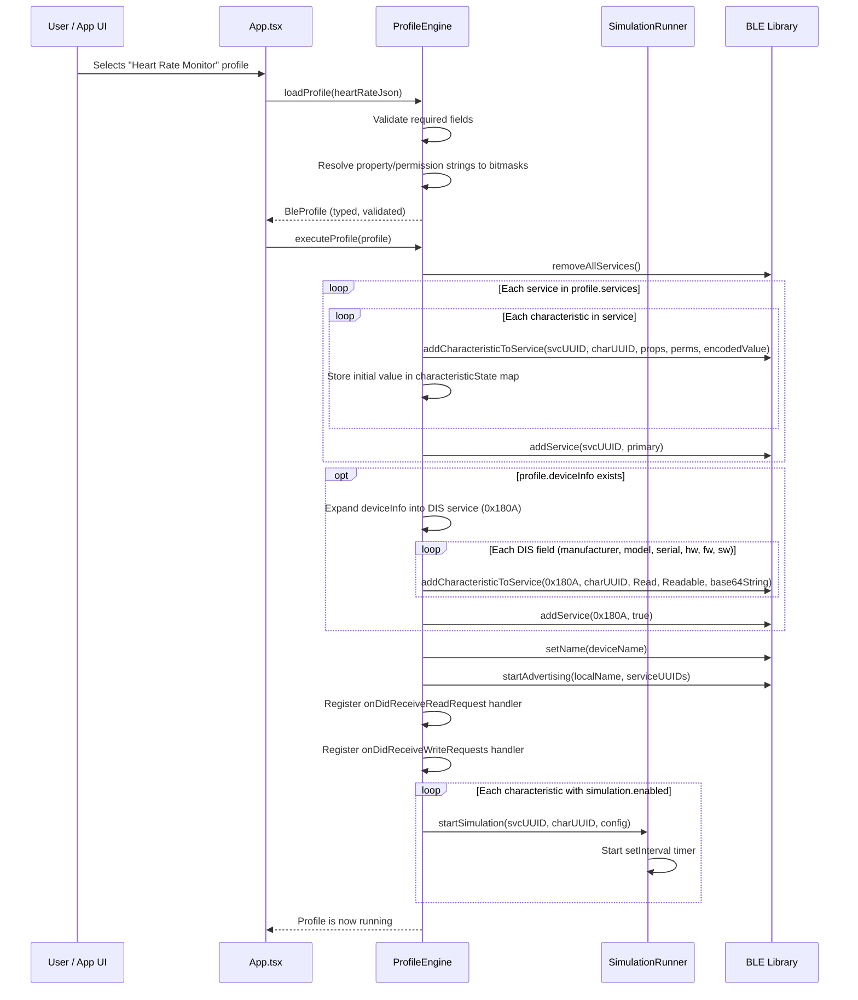


### 7.2 Read Request Handling

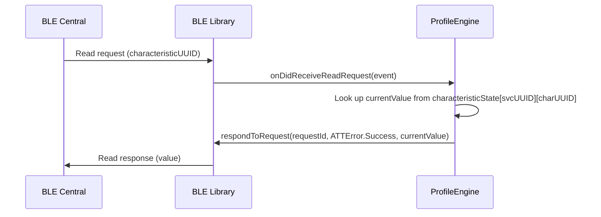


### 7.3 Write Request Handling

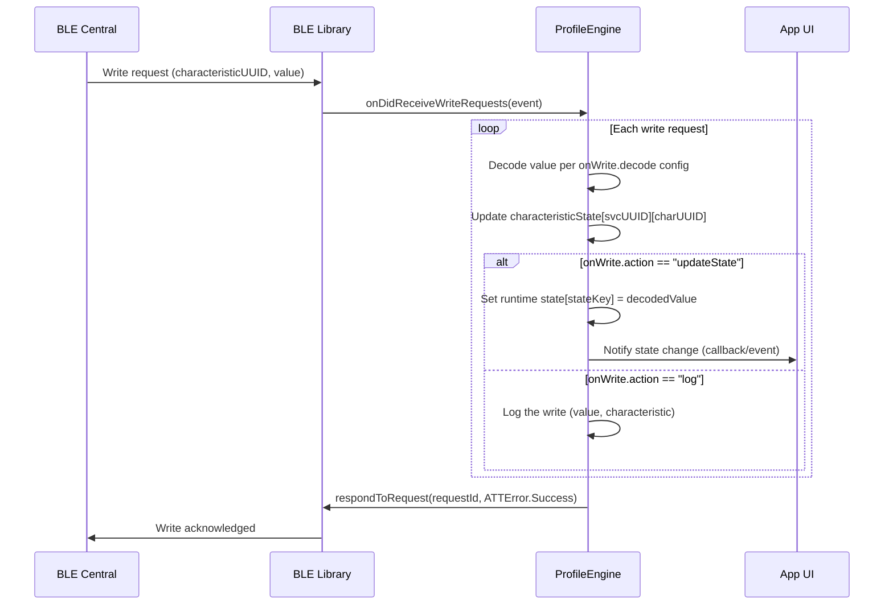


### 7.4 Simulation Value Update Flow

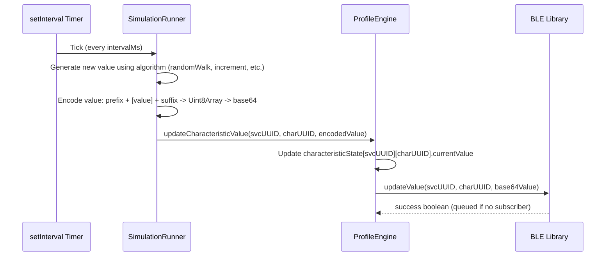


### 7.5 Manual UI Override Flow

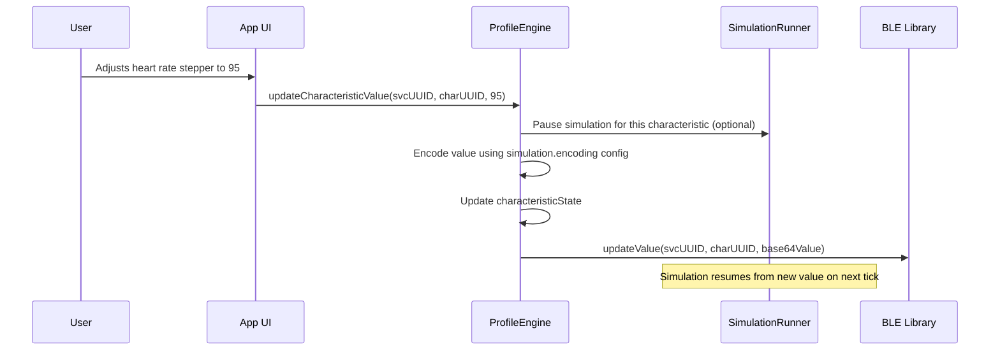


### 7.6 State Machine Transition Flow

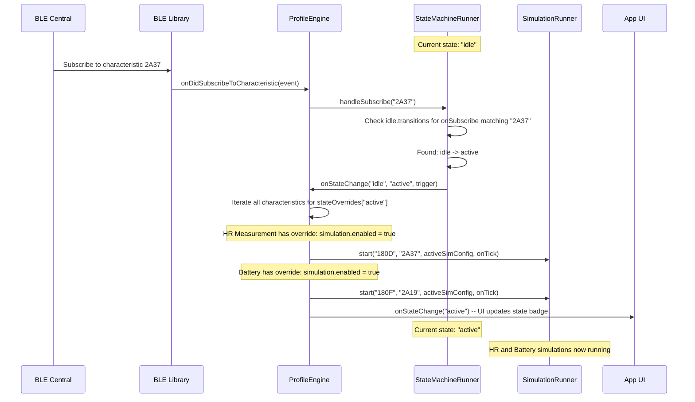


### 7.7 State Machine with Timer Auto-Transition

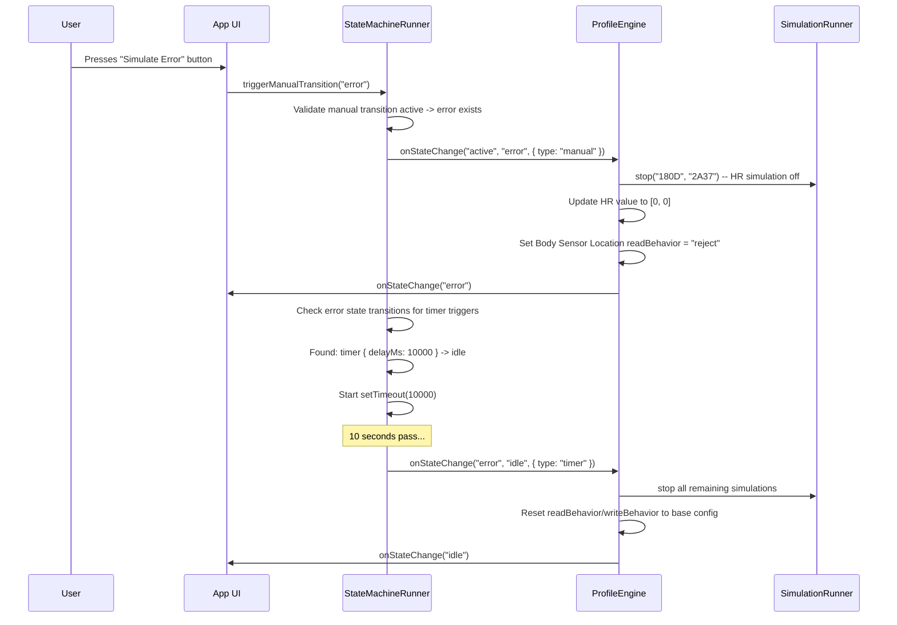


---

## 9. State Management

### 9.1 Engine Internal State

The `ProfileEngine` maintains runtime state in a nested `Map`:

```
characteristicState: Map<serviceUUID, Map<charUUID, CharacteristicRuntimeState>>
```

Where `CharacteristicRuntimeState` is:

```typescript
interface CharacteristicRuntimeState {
  currentValue: number | number[] | string;  // current decoded value
  encodedValue: string;                       // current base64-encoded value for the library
  definition: ProfileCharacteristic;          // reference to the profile definition
  serviceUUID: string;                        // parent service UUID
  simulationTimer?: NodeJS.Timeout;           // active simulation timer (if any)
  simulationPaused?: boolean;                 // true when user manually overrides
}
```

### 9.2 Write State (for onWrite.action = "updateState")

A separate flat map for named state values that the UI can observe:

```
writeState: Map<stateKey, any>
```

Example: when a central writes `0x01` to the LBS LED characteristic, the engine sets `writeState["ledState"] = true`, and the app UI renders the LED as ON.

### 9.3 State Machine Runtime State

The `StateMachineRunner` maintains:

```typescript
interface StateMachineRuntimeState {
  currentStateId: string;
  currentTimerHandle?: NodeJS.Timeout;  // for timer-based auto-transitions
  stateEnteredAt: number;               // timestamp for state duration tracking
}
```

The engine also tracks per-characteristic effective behavior:

```typescript
interface EffectiveCharacteristicBehavior {
  readBehavior: 'normal' | 'reject' | 'static';
  writeBehavior: 'normal' | 'reject' | 'log';
  rejectError?: string;
  activeSimulation?: SimulationConfig;
}
```

On state change, the engine recomputes effective behavior for each characteristic by merging base config with `stateOverrides[newStateId]`.

### 9.4 Event Listener Cleanup

The engine stores references to all event subscriptions created during `executeProfile()`:

```
subscriptions: Array<{ remove(): void }>
```

`stopProfile()` calls `.remove()` on each, then clears the array.

---

## 10. Encoding Utils (`encodingUtils.ts`)

Pure utility functions with no side effects. Used by both `ProfileEngine` (initial values) and `SimulationRunner` (ongoing updates).

```typescript
// Encode a string value to base64
function encodeStringValue(str: string): string

// Encode a single byte (0-255) to base64
function encodeUint8Value(value: number): string

// Encode a byte array to base64
function encodeUint8ArrayValue(bytes: number[]): string

// Encode a hex string (e.g. "0048") to base64
function encodeHexValue(hex: string): string

// Master dispatcher: given a CharacteristicValueDef, encode the initial value
function encodeInitialValue(valueDef: CharacteristicValueDef): string

// Encode a simulation tick value using SimulationEncoding config
function encodeSimulationValue(value: number, encoding: SimulationEncoding): string
```

All functions ultimately produce a base64 string suitable for `addCharacteristicToService()` or `updateValue()`.

---

## 11. State Machine Runner (`stateMachineRunner.ts`)

Manages the current device state and evaluates transition triggers. Fully generic -- it reads the `ProfileStateMachine` config and acts on it without knowing what the states mean.

### 11.1 API

```typescript
class StateMachineRunner {
  constructor(
    stateMachine: ProfileStateMachine,
    callbacks: StateMachineCallbacks
  );

  // Current state
  getCurrentState(): string;
  getCurrentStateDefinition(): StateDefinition;

  // Evaluate a BLE event against current state's transitions
  handleSubscribe(characteristicUUID: string): void;
  handleUnsubscribe(characteristicUUID: string): void;
  handleWrite(characteristicUUID: string, decodedValue: number): void;

  // Manual transition (from UI button)
  triggerManualTransition(targetStateId: string): void;

  // Get available manual transitions for UI rendering
  getManualTransitions(): Array<{ to: string; label: string }>;

  // Cleanup (clear timers)
  stop(): void;
}
```

### 11.2 Callbacks

```typescript
interface StateMachineCallbacks {
  // Called when state changes -- engine uses this to apply stateOverrides
  onStateChange(
    fromState: string,
    toState: string,
    trigger: TransitionTrigger
  ): void;

  // Called for logging
  onLog(message: string): void;
}
```

### 11.3 Internal Behavior

- On construction, sets `currentState` to `stateMachine.initial`
- When a BLE event occurs (`handleSubscribe`, `handleWrite`, etc.), iterates the current state's `transitions` array in order. The first transition whose trigger matches fires.
- For `timer` triggers: on state entry, starts a `setTimeout` with `delayMs`. If the state changes before the timer fires, the timer is cleared. Only one timer per state at a time.
- `triggerManualTransition(targetStateId)` validates that a manual transition to `targetStateId` exists in the current state's transitions, then fires it.
- On state change, calls `onStateChange` callback so the engine can apply `stateOverrides`.

### 11.4 State Transition Data Flow

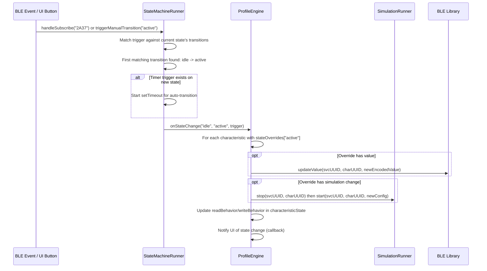


---

## 12. Simulation Runner (`simulationRunner.ts`)

### 10.1 API

```typescript
class SimulationRunner {
  // Start a simulation for a specific characteristic
  start(
    serviceUUID: string,
    charUUID: string,
    config: SimulationConfig,
    onTick: (serviceUUID: string, charUUID: string, encodedValue: string) => void
  ): void;

  // Stop a specific simulation
  stop(serviceUUID: string, charUUID: string): void;

  // Stop all running simulations
  stopAll(): void;

  // Pause/resume (for manual override)
  pause(serviceUUID: string, charUUID: string): void;
  resume(serviceUUID: string, charUUID: string): void;
}
```

### 10.2 Value Generation Algorithms

Each algorithm maintains a `currentValue` and produces a new numeric value each tick:

- `**randomRange**`: `Math.floor(Math.random() * (max - min + 1)) + min`
- `**randomWalk**`: `clamp(current + (Math.random() > 0.5 ? step : -step), min, max)`
- `**increment**`: `current + step > max ? min : current + step`
- `**decrement**`: `current - step < min ? max : current - step`
- `**sine**`: `Math.round(mid + amplitude * Math.sin(tickCount * 2 * Math.PI / period))` where `period` is derived from `(max - min) / step`

### 10.3 Encoding Pipeline

After generating a numeric value, the runner encodes it:

1. Start with the raw numeric value (e.g. `95`)
2. Apply `encoding.prefix` (e.g. `[0]` for HR flags byte) -> `[0, 95]`
3. Apply `encoding.suffix` if any -> `[0, 95]`
4. Convert to `Uint8Array` -> base64 string
5. Pass to the `onTick` callback

---

## 13. Profile Registry (`profileRegistry.ts`)

Simple module that bundles all included profile JSONs:

```typescript
import heartRate from './data/heart-rate.json';
import lbs from './data/lbs.json';

export const BUNDLED_PROFILES: BleProfile[] = [heartRate, lbs];

export function getProfileById(id: string): BleProfile | undefined;
export function getProfileNames(): Array<{ id: string; name: string; description?: string }>;
```

---

## 14. Example App -- Dual Mode Architecture (Legacy vs Profile)

The app supports two mutually exclusive runtime modes so you can run the same BLE peripheral using the old hardcoded approach or the new profile-based approach and compare results side by side (e.g. using nRF Connect on another device to inspect the GATT table).

### 14.1 Mode Chooser Flow

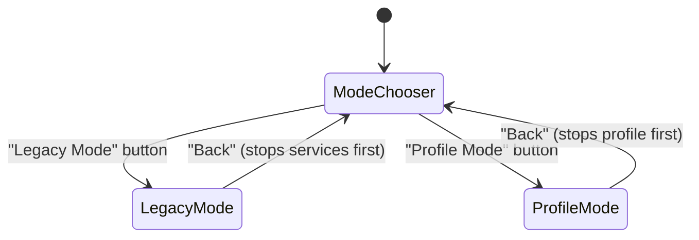


### 14.2 App.tsx -- Mode Chooser (Entry Point)

The new `App.tsx` is a thin wrapper that:

1. Shows a **mode selection screen** on launch with two large buttons: "Legacy Mode" and "Profile Mode"
2. Renders `<LegacyApp />` or `<ProfileApp />` based on selection
3. Provides a "Back to Mode Selection" button in both modes that first stops any active BLE services/profiles before returning to the chooser

```typescript
type AppMode = 'chooser' | 'legacy' | 'profile';

export default function App() {
  const [mode, setMode] = useState<AppMode>('chooser');

  if (mode === 'legacy') return <LegacyApp onBack={() => setMode('chooser')} />;
  if (mode === 'profile') return <ProfileApp onBack={() => setMode('chooser')} />;
  return <ModeChooserScreen onSelect={setMode} />;
}
```

The `ModeChooserScreen` shows:

- App title and BLE state indicator (shared)
- "Legacy Mode" card -- description: "Hardcoded Heart Rate / LBS services (original implementation)"
- "Profile Mode" card -- description: "JSON-driven profiles with simulation and dynamic controls"

### 14.3 LegacyApp.tsx -- Extracted Legacy Code

The current `App.tsx` content is moved **as-is** into `LegacyApp.tsx` with minimal changes:

- Accepts an `onBack: () => void` prop
- Adds a "Back" button in the header that calls `handleStopService()` then `onBack()`
- All existing Heart Rate / LBS / Battery / DIS logic, event handlers, and UI remain **untouched**
- This preserves the legacy behavior as a reference implementation for comparison

### 14.4 ProfileApp.tsx -- Profile-Based UI

The new profile-driven UI with these sections:

**Header**: Same status bar (BLE state, advertising indicator) + "Back" button

**Profile Picker**: Data-driven list from `BUNDLED_PROFILES`:

- Each profile shown as a selectable card with `name` and `description`
- Selecting a profile calls `engine.loadProfile()` then `engine.executeProfile()`
- Active profile is highlighted; "Stop" button appears
- Only one profile can be active at a time

**Dynamic Controls**: When a profile is active, for each service in the profile:

- Service name as a section header (e.g. "Heart Rate", "Battery")
- For each characteristic with a `ui` hint, render the control:
  - `stepper`: +/- buttons with current value and unit (heart rate BPM, temperature C)
  - `slider`: draggable slider with min/max and current value (battery %)
  - `toggle`: on/off switch (button pressed/released)
  - `readonly`: display-only value with label (LED state controlled by central)

**State Machine Controls** (shown when profile has `stateMachine`):

- **State indicator**: Badge showing current state name + description (e.g. "Active -- Actively monitoring heart rate")
- **Manual transition buttons**: Rendered from `stateMachineRunner.getManualTransitions()`. Each button shows the transition's `label` (e.g. "Simulate Error", "Clear Error"). Only manual transitions from the current state are shown.
- **State history**: Optional log of state transitions in the debug panel (auto-logged by the engine)
- Auto-transitions (timer, onSubscribe, etc.) happen without user action and the UI updates reactively

**Simulation Controls**:

- Global simulation on/off toggle
- Individual simulation status shown per-characteristic (small indicator)
- Manual value changes pause that characteristic's simulation; it resumes from the new value
- Note: simulations are state-aware -- they may auto-start/stop on state transitions per `stateOverrides`

**Debug Log Panel**: Shared `DebugLogPanel` component, same as legacy

### 14.5 React Integration for ProfileApp

The `ProfileEngine` is pure TypeScript (no React dependency). `ProfileApp.tsx` integrates it via:

- `useRef` to hold the engine instance (created once)
- `useState` for: `activeProfile`, `characteristicValues` (Map synced from engine state on every update), `writeState` (Map synced from engine's write state), `simulationsEnabled`, `currentState` (from state machine)
- `useCallback` wrappers for manual value changes that call `engine.updateCharacteristicValue()`
- Engine provides callback hooks: `onLog`, `onValueChange`, `onWriteStateChange`, `onStateChange` that `ProfileApp` uses to sync React state
- `useEffect` cleanup that calls `engine.stopProfile()` on unmount or when navigating back

### 14.6 Comparison Testing Workflow

To compare legacy vs profile output:

1. Launch app -> select "Legacy Mode" -> start "Heart Rate"
2. On a second device, use nRF Connect to scan, connect, and inspect the GATT table
3. Stop, go back to mode chooser
4. Select "Profile Mode" -> select "Heart Rate Monitor" profile
5. On the second device, scan again and compare the GATT table
6. Both should show identical services, characteristics, UUIDs, properties, and permissions
7. The profile mode additionally shows Body Sensor Location and HR Control Point (optional SIG characteristics not in legacy)

---

## 15. Key Design Decisions


| Decision                                          | Rationale                                                                                                          |
| ------------------------------------------------- | ------------------------------------------------------------------------------------------------------------------ |
| **Strings for properties/permissions in JSON**    | Human-readable profiles; engine handles bitmask conversion                                                         |
| `**deviceInfo` top-level shorthand**              | DIS is near-universal; avoids 6-characteristic boilerplate in every profile                                        |
| **Simulation per-characteristic**                 | Different chars need different behaviors (HR random walk vs battery decrement)                                     |
| **UI hints in the profile**                       | Makes the app fully data-driven; no hardcoded UI per service type                                                  |
| **Engine has no React dependency**                | Pure TypeScript enables future extraction to a package; testable without RN                                        |
| `**onWrite` action model**                        | Keeps write handling declarative; `"updateState"` drives the UI, `"log"` for debug                                 |
| **Manual override pauses simulation**             | User intent takes priority; simulation resumes from the new value                                                  |
| **Encoding abstraction**                          | Hides the base64/byte complexity from profile authors; they think in types and numbers                             |
| **Profile lives in example app for now**          | Iterating fast; clean interfaces allow later extraction to standalone package or cloud                             |
| **Dual-mode app (Legacy vs Profile)**             | Side-by-side comparison ensures profile output matches legacy; legacy code preserved as reference                  |
| **LegacyApp.tsx extracted untouched**             | Zero-risk refactor; legacy behavior is the baseline for validating profile correctness                             |
| **Profiles include optional SIG characteristics** | Heart Rate profile adds Body Sensor Location + Control Point beyond legacy; demonstrates profile extensibility     |
| **State machine is optional per-profile**         | Profiles without `stateMachine` work exactly as before (no breaking change); states are additive complexity        |
| **State overrides per-characteristic**            | Each characteristic can behave differently per state via `stateOverrides`; merges on top of base config            |
| **Transition triggers are generic**               | `onSubscribe`, `onUnsubscribe`, `onWrite`, `manual`, `timer` -- no profile-specific trigger types needed           |
| **Timer transitions for auto-recovery**           | Error states can auto-reset via `timer` trigger, simulating real device behavior                                   |
| **Engine is 100% generic**                        | ZERO profile-specific code. All behavior driven by JSON schema. Any valid profile JSON works without code changes. |
| **Clean TypeScript, no `any`**                    | Strict types, JSDoc on exports, self-documenting names, readable over clever                                       |
| **Right-sized modules, not over-granular**        | 6 source files + 2 JSON profiles. Each file has one responsibility. No 10-line files.                              |
| **Flat dependency tree for portability**          | Leaves depend only on `types.ts`; only `profileEngine.ts` orchestrates; easy to extract to package                 |
| **Engine/runners have zero React dependency**     | Pure TypeScript; React integration only in `ProfileApp.tsx` (outside `profiles/` folder)                           |
| **Tests written after code logic is finalized**   | Manual testing first via Legacy vs Profile comparison; automated tests added in a follow-up phase                  |


---

## 16. Error Handling

- **Profile validation**: `loadProfile()` throws descriptive errors for missing required fields (`id`, `name`, `advertising.localName`, `services`, characteristic `uuid`/`properties`/`permissions`)
- **Unknown property/permission strings**: Throws with the invalid string and valid options listed
- **Encoding errors**: `encodeInitialValue()` throws if `type` and `initial` are mismatched (e.g. `type: "uint8"` with `initial: "hello"`)
- **BLE library errors**: `executeProfile()` catches and logs errors from `addService`, `startAdvertising`, etc. without crashing
- **Simulation errors**: Individual timer errors are caught and logged; one failing simulation doesn't stop others
- **State machine validation**: `loadProfile()` validates that `stateMachine.initial` exists in `states`, all transition `to` targets exist, and `stateOverrides` keys on characteristics reference valid state IDs
- **Invalid state transitions**: `triggerManualTransition()` logs a warning if the target state is not reachable from the current state; does not throw
- **Timer cleanup**: All `setTimeout` handles are tracked and cleared on `stopProfile()` or state change to prevent dangling timers

---

## 17. Future Considerations

- **Cloud-hosted profiles**: Load profile JSON from a URL instead of bundled files. The `loadProfile()` API already accepts plain objects, so fetching JSON from a server requires minimal changes.
- **Standalone package**: Extract `profiles/` into its own npm package (e.g. `@ble-peripheral/profiles`) with `react-native-ble-peripheral-manager` as a peer dependency.
- **Profile editor UI**: A screen in the app to create/edit profiles visually instead of writing JSON by hand.
- **Profile sharing**: Export/import profiles via QR code, deep link, or file sharing.
- **More simulation types**: Waveform patterns, recorded data replay, conditional logic.
- **Descriptor support**: When the library adds explicit descriptor APIs, profiles should support custom descriptors per characteristic.
- **Conditional state transitions**: Transitions with complex conditions (e.g. "only transition to error if battery < 10%") using expression evaluation.
- **State-dependent advertising**: Different advertising data per state (e.g. change local name to indicate error state).
- **Nested/parallel state machines**: Hierarchical states (e.g. `active.measuring` vs `active.idle`) for complex device emulation.

---

## 18. Documentation (`example/src/profiles/docs/`)

Four comprehensive markdown files, each with mermaid diagrams and/or timeline charts where they aid understanding. All docs are self-contained -- a reader should be able to understand each doc without reading the others, though they cross-reference each other.

### 18.0 profiles-system-plan.md -- Persistent Design Plan

**Created FIRST, before any code.** This is a copy of the full Cursor plan document committed to the repo so it survives across sessions and can be referenced by any future chat.

- Contains ALL design decisions, schema specs, data flows, state machine details, code quality standards, testing strategy
- Lives in the repo at `example/src/profiles/docs/profiles-system-plan.md`
- When the Cursor plan is updated, this file should be kept in sync
- Any future session can `@example/src/profiles/docs/profiles-system-plan.md` to get full context on the profile system design

### 18.1 PROFILE_SCHEMA.md -- Profile JSON Schema Reference

The definitive reference for the profile JSON format. Audience: developers writing or modifying profiles.

**Outline:**

1. **Overview** -- What a profile is, how it drives the engine
2. **Quick Start Example** -- Minimal valid profile (smallest possible JSON that works)
3. **Top-Level Fields** -- Table of all top-level fields with types, required/optional, defaults
4. **Advertising** -- `ProfileAdvertising` fields, how `serviceUUIDs` auto-derives
5. **Device Information Shorthand** -- `ProfileDeviceInfo` fields, DIS UUID mapping table
6. **Services** -- `ProfileService` fields
7. **Characteristics** -- `ProfileCharacteristic` fields (the core of the schema)
8. **Properties and Permissions** -- Complete mapping tables (string -> bitmask -> hex)

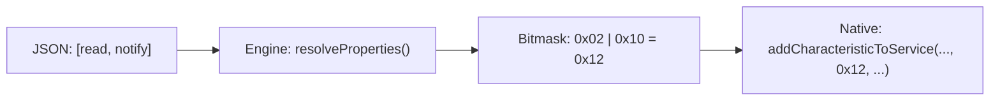


1. **Value Definitions** -- `CharacteristicValueDef` types with encoding examples
  Visual table showing each `type` with example `initial` value and the resulting base64 output:

```
   type: "string"     initial: "Hello"     -> btoa("Hello")     -> "SGVsbG8="
   type: "uint8"      initial: 72          -> Uint8Array([72])   -> "SA=="
   type: "uint8Array" initial: [0, 72]     -> Uint8Array([0,72]) -> "AEg="
   type: "hex"        initial: "0048"      -> bytes [0x00,0x48]  -> "AEg="
   type: "base64"     initial: "AEg="      -> passthrough        -> "AEg="
   

```

1. **Simulation Config** -- All simulation fields, algorithm descriptions with visual output
  Timeline chart showing each algorithm's output pattern over 10 ticks:

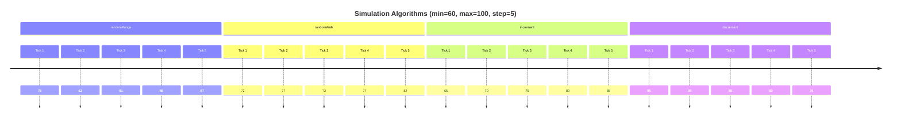


1. **Simulation Encoding** -- `prefix`/`suffix` byte assembly with visual pipeline

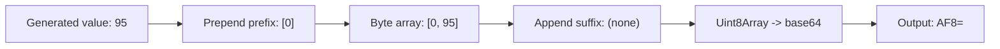


1. **UI Hints** -- Control types with description of rendered appearance
2. **Write Actions** -- `onWrite` config, decode types, state key updates
3. **State Machine** -- Full state machine schema
  State diagram for the Heart Rate profile:

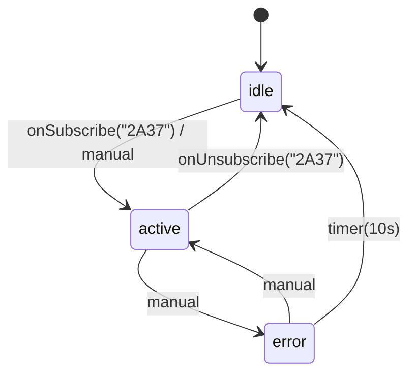


1. **State Overrides** -- `stateOverrides` merge logic with before/after examples
2. **Ignored Fields** -- Fields like `_comment` that the engine skips (for documentation in JSON)
3. **Validation Rules** -- What `loadProfile()` validates and error messages

### 18.2 ENGINE_GUIDE.md -- Profile Engine Architecture

Deep dive into how the engine works internally. Audience: developers maintaining or extending the engine code.

**Outline:**

1. **Overview** -- What the engine does, the generic principle, module dependencies

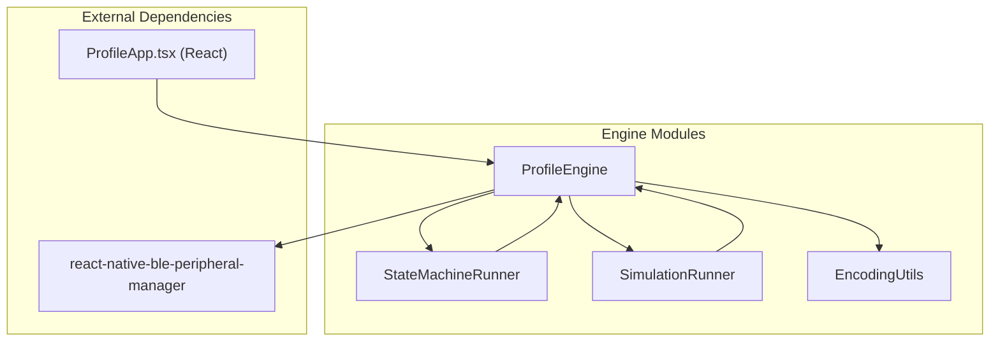


1. **Module Responsibilities** -- What each file does (one paragraph each)
2. **Profile Lifecycle** -- The full journey from JSON to running BLE peripheral

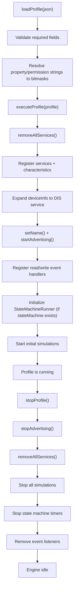


1. **GATT Registration Order** -- Why characteristics must be added before services, how the engine ensures correct order
2. **Read Request Pipeline** -- Step-by-step trace through a read request with state-awareness

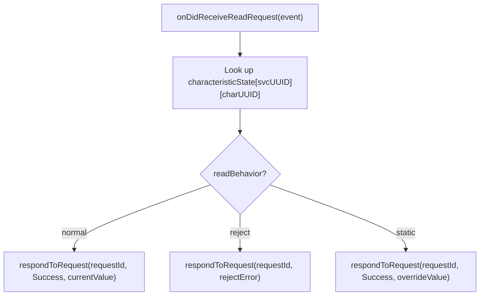


1. **Write Request Pipeline** -- Step-by-step trace including `onWrite` actions and state machine trigger evaluation

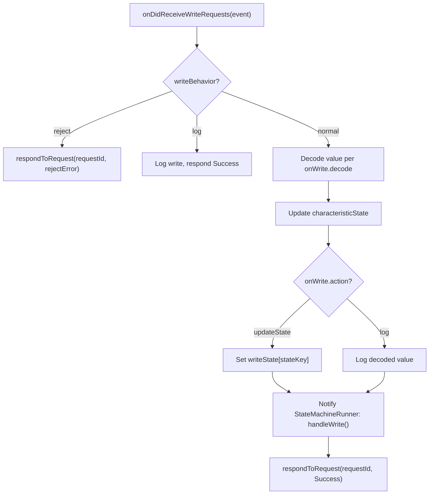


1. **State Machine Integration** -- How `ProfileEngine` and `StateMachineRunner` interact

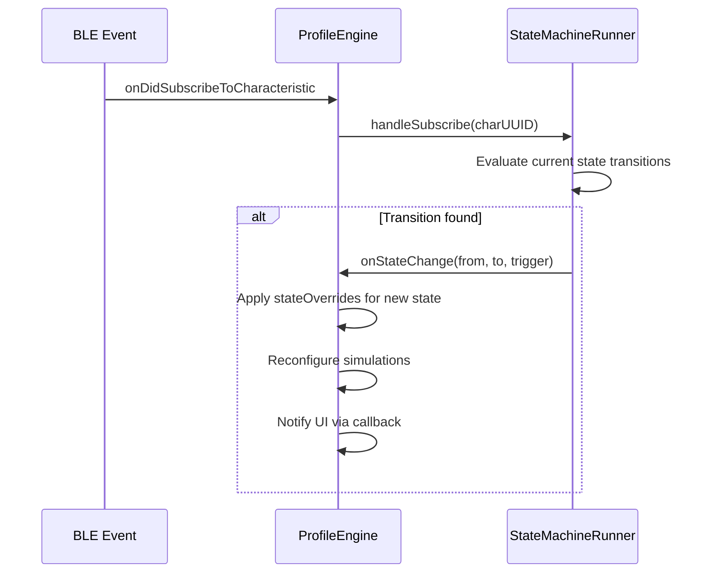


1. **State Override Application** -- Merge algorithm walkthrough with concrete example
2. **Simulation Lifecycle** -- How simulations start, stop, pause, resume, and respond to state changes

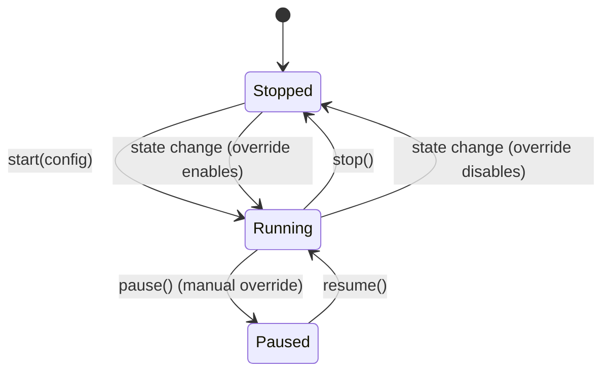


1. **Encoding Pipeline** -- Detailed trace from profile value definition to base64 bytes on the wire
2. **Callback System** -- How the engine communicates with the React layer (onLog, onValueChange, onWriteStateChange, onStateChange)
3. **Cleanup and Teardown** -- What `stopProfile()` cleans up and in what order
4. **Error Handling** -- Where errors are caught, what's logged vs thrown

### 18.3 AUTHORING_GUIDE.md -- How to Create a New Profile

Tutorial-style guide for creating a profile from scratch. Audience: anyone who wants to add a new BLE device emulation.

**Outline:**

1. **Introduction** -- What you'll build, prerequisites
2. **Step 1: Define Your Device** -- Decide on services, characteristics, UUIDs
  Checklist:
  - What BLE services does your device expose?
  - What are the UUIDs? (standard short UUIDs or custom 128-bit)
  - For each characteristic: Read? Write? Notify? What permissions?
  - What values do characteristics hold? What encoding?
3. **Step 2: Create the JSON Skeleton** -- Start with minimal required fields

```json
   {
     "id": "my-device",
     "name": "My Custom Device",
     "advertising": { "localName": "MyDevice" },
     "services": []
   }
   

```

1. **Step 3: Add Services and Characteristics** -- Build up the GATT table
  Flowchart showing decision tree for characteristic properties:

```mermaid
   flowchart TD
     Start["New Characteristic"] --> CanRead{"Central reads this value?"}
     CanRead -->|Yes| AddRead["Add 'read' to properties"]
     CanRead -->|No| SkipRead[" "]
     AddRead --> CanWrite{"Central writes to this?"}
     SkipRead --> CanWrite
     CanWrite -->|Yes| WriteType{"Response required?"}
     CanWrite -->|No| CanNotify{"Value changes over time?"}
     WriteType -->|Yes| AddWrite["Add 'write'"]
     WriteType -->|No| AddWWR["Add 'writeWithoutResponse'"]
     AddWrite --> CanNotify
     AddWWR --> CanNotify
     CanNotify -->|Yes| AddNotify["Add 'notify'"]
     CanNotify -->|No| Done["Done"]
     AddNotify --> Done
   

```


1. **Step 4: Add Device Information** -- Use the `deviceInfo` shorthand
2. **Step 5: Add Simulation (Optional)** -- Choose an algorithm, set parameters
  Decision guide:

```mermaid
   flowchart TD
     Start["Want simulation?"] -->|Yes| Pattern{"Value pattern?"}
     Start -->|No| NoSim["Skip simulation field"]
     Pattern -->|Random each tick| RR["type: randomRange"]
     Pattern -->|Drifts gradually| RW["type: randomWalk"]
     Pattern -->|Counts up| Inc["type: increment"]
     Pattern -->|Counts down| Dec["type: decrement"]
     Pattern -->|Oscillates smoothly| Sin["type: sine"]
   

```


1. **Step 6: Add UI Hints (Optional)** -- Choose control types for the example app
2. **Step 7: Add State Machine (Optional)** -- Define states and transitions
  Timeline of a typical state machine design session:

```mermaid
   flowchart TD
     Identify["Identify device states\n(idle, active, error, etc.)"] --> Draw["Draw state transitions\n(what triggers each?)"]
     Draw --> Overrides["Define per-state behavior\n(which chars change?)"]
     Overrides --> Triggers["Choose trigger types\n(manual, onSubscribe, timer)"]
     Triggers --> Test["Test: trace each scenario\nthrough the state machine"]
   

```


1. **Step 8: Add Write Handlers (Optional)** -- Configure `onWrite` for writable characteristics
2. **Step 9: Register the Profile** -- Add to `profileRegistry.ts`
3. **Step 10: Test It** -- Run in profile mode, verify with nRF Connect
4. **Complete Example** -- Full annotated profile JSON for a "Temperature Sensor" as a walkthrough result
5. **Troubleshooting** -- Common mistakes and how to fix them
6. **Profile JSON Checklist** -- Quick reference checklist before shipping a profile

### 18.4 EXAMPLE_APP_README.md -- Example App User Guide

How to run and use the example app. Audience: anyone running the example app for the first time.

**Outline:**

1. **Overview** -- What the example app does, dual-mode architecture
2. **Prerequisites** -- Node, React Native environment, physical device (BLE doesn't work on simulator for peripheral mode)
3. **Running the App**
  - iOS: `npx pod-install && npx react-native run-ios`
  - Android: `npx react-native run-android`
  - Permissions required (Bluetooth, Android 12+ runtime permissions)
4. **Mode Selection** -- What you see on launch

```mermaid
   flowchart TD
     Launch["App Launch"] --> Chooser["Mode Chooser Screen"]
     Chooser -->|"Legacy Mode"| Legacy["LegacyApp.tsx\nHardcoded HR / LBS"]
     Chooser -->|"Profile Mode"| Profile["ProfileApp.tsx\nJSON-driven profiles"]
     Legacy -->|Back| Chooser
     Profile -->|Back| Chooser
   

```


1. **Legacy Mode** -- How to use (select HR or LBS, adjust values, see logs)

```mermaid
   flowchart LR
     Select["Select Heart Rate or LBS"] --> Start["Services registered + advertising"]
     Start --> Interact["Adjust HR / toggle button"]
     Interact --> Log["See events in debug log"]
     Log --> Stop["Press Stop"]
   

```


1. **Profile Mode** -- How to use (select profile, see state, adjust controls)

```mermaid
   flowchart LR
     Pick["Pick a profile"] --> Execute["Engine executes profile"]
     Execute --> State["State machine starts (idle)"]
     State --> Controls["Use controls + state buttons"]
     Controls --> Monitor["Watch debug log"]
     Monitor --> Stop["Press Stop"]
   

```


1. **State Machine in Action** -- What the state indicator shows, how transitions work, manual vs auto
  Timeline showing a typical Heart Rate session:

```mermaid
   timeline
     title Heart Rate Profile Session
     section Startup
       App launches : Mode chooser shown
       Select Profile Mode : Profile picker shown
       Select Heart Rate : GATT registered, advertising
     section State: idle
       State badge shows Idle : No simulation running
       Central subscribes to HR : Auto-transition to Active
     section State: active
       HR simulation starts : Values 60-120 BPM
       Battery drains : 100% -> 99% -> ...
       User taps Simulate Error : Manual transition to Error
     section State: error
       HR sends 0 BPM : Reads rejected
       Timer counting down : 10 seconds
       Auto-reset to Idle : Simulations stop
   

```


1. **Comparing Legacy vs Profile** -- Step-by-step testing workflow with nRF Connect
2. **Debug Log** -- What the log entries mean, event types, native log messages
3. **Troubleshooting** -- Common issues (Bluetooth off, permissions denied, advertising fails)

### 18.5 Documentation Principles

All four docs follow these principles:

- **Mermaid diagrams** used wherever visual flow aids understanding (state machines, data flows, decision trees, pipelines, timelines)
- **Self-contained** -- each doc can be read independently
- **Cross-referenced** -- docs link to each other where relevant (e.g. AUTHORING_GUIDE links to PROFILE_SCHEMA for field details)
- **Code examples** -- real JSON and TypeScript snippets, not pseudocode
- **Progressive disclosure** -- start simple, add complexity (e.g. AUTHORING_GUIDE starts with minimal profile, adds simulation, then state machine)
- **Updated alongside code** -- when the schema or engine changes, docs are updated in the same PR

---

## Changelog


| Date       | Change                                                                               | Reason                                                                                      |
| ---------- | ------------------------------------------------------------------------------------ | ------------------------------------------------------------------------------------------- |
| 2026-03-23 | Initial design document created                                                      | Planning phase for profile-based BLE peripheral emulation                                   |
| 2026-03-23 | Decided on "Profile" naming over "Config"                                            | Aligns with Bluetooth SIG terminology; conveys complete device personality                  |
| 2026-03-23 | Chose example app location (`example/src/profiles/`)                                 | Fast iteration now; extraction-ready for later package/cloud move                           |
| 2026-03-23 | Decided on both simulation + manual controls                                         | User requested support for automatic simulation with manual UI override                     |
| 2026-03-23 | Added comprehensive schema spec, data flows, state mgmt, encoding details            | User requested thorough documentation of all profile design details                         |
| 2026-03-23 | Added Legacy-to-Profile parity matrix (section 5)                                    | Documenting exact GATT breakdown of legacy code to ensure profile parity                    |
| 2026-03-23 | Added complete BLE SIG characteristics to HR profile                                 | Heart Rate profile now includes Body Sensor Location (0x2A38) and HR Control Point (0x2A39) |
| 2026-03-23 | Matched LBS profile deviceInfo to legacy DEVICE_INFO constant                        | Ensures identical DIS values between legacy and profile modes                               |
| 2026-03-23 | Redesigned App.tsx as dual-mode: Legacy vs Profile chooser                           | User needs to compare legacy and profile-based output side by side                          |
| 2026-03-23 | Added LegacyApp.tsx extraction step                                                  | Current App.tsx code moved untouched to preserve legacy reference                           |
| 2026-03-23 | Added ProfileApp.tsx as new profile-driven UI                                        | Separate component for profile mode with dynamic controls                                   |
| 2026-03-23 | Added comparison testing workflow (section 13.6)                                     | Documented how to use nRF Connect to verify GATT parity between modes                       |
| 2026-03-23 | Added State Machine system (sections 4.11-4.16, 7.6-7.7, 9.3, 11)                    | Profiles can define states with transitions and per-state characteristic behavior overrides |
| 2026-03-23 | Added `stateOverrides` to ProfileCharacteristic                                      | Characteristics can have different simulation, value, read/write behavior per device state  |
| 2026-03-23 | Added StateMachineRunner module (section 11)                                         | Dedicated runner for state evaluation, trigger matching, timer management                   |
| 2026-03-23 | Updated HR profile with state machine: idle -> active -> error                       | HR simulation only runs in `active` state; `error` rejects reads, sends zero BPM            |
| 2026-03-23 | Updated LBS profile with state machine: idle -> active -> error                      | LED writes rejected in `error`; button sends 0xFF error code; auto-reset via timer          |
| 2026-03-23 | Established Generic Engine Principle (section 2.1)                                   | Engine must have ZERO profile-specific code; all behavior driven by JSON schema             |
| 2026-03-23 | Added 5 transition trigger types: manual, onSubscribe, onUnsubscribe, onWrite, timer | Covers BLE events + user interaction + timed auto-transitions                               |
| 2026-03-23 | Added documentation plan: 4 comprehensive markdown files (section 18)                | PROFILE_SCHEMA.md, ENGINE_GUIDE.md, AUTHORING_GUIDE.md, EXAMPLE_APP_README.md               |
| 2026-03-23 | Docs location: `example/src/profiles/docs/`                                          | Keeps docs close to the profile code; moves with it during future package extraction        |
| 2026-03-23 | Planned 20+ mermaid diagrams across all docs                                         | State diagrams, flowcharts, sequence diagrams, timelines for visual understanding           |
| 2026-03-23 | Added Code Quality Standards (section 2.2)                                           | Clean TypeScript, no `any`, JSDoc, self-documenting names, right-sized modules              |
| 2026-03-23 | Added Testing Strategy (section 2.3)                                                 | Tests deferred to Phase 2 after manual testing; covers unit + integration for all modules   |
| 2026-03-23 | Added profiles-system-plan.md as FIRST build step                                    | Persistent design doc committed to repo at `example/src/profiles/docs/` for future sessions |


