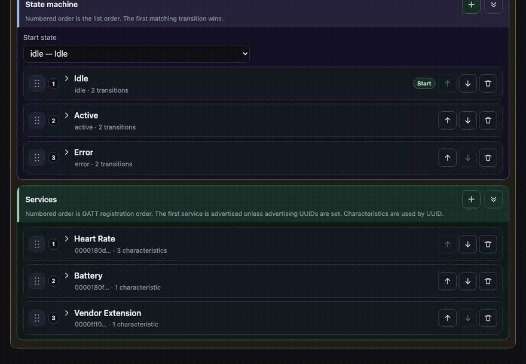

# Remote Profile — admin + API for server-driven BLE profiles

Small **full-stack demo** that shows how JSON BLE profiles can be **managed centrally** and **consumed** by `peripheral-app` at runtime, using the same `ProfileEngine` path as bundled local JSON.

## Stack

| Layer | Choice | Why |
|--------|--------|-----|
| Admin UI | React 19 + TypeScript + Vite + `@dnd-kit` | Visual drag-and-drop builder, with a JSON tab for the same document |
| API | Express + TypeScript (`tsx` for dev) | Familiar, minimal boilerplate |
| Persistence | **Single JSON file** (`server/data/store.json`) | Easiest to inspect, diff, and reset for a demo (no DB process). Seeded from `server/seed/initial-store.json` on first run. |

**Not used:** Postgres, Docker, Prisma, cloud auth.

## Local Wi‑Fi E2E (peripheral-app + remote-profile, no tunnel)

Use this when the phone and Mac share the **same Wi‑Fi** (no ngrok / loca.lt).

1. **Free ports** if something is already running:

   ```bash
   bash remote-profile/scripts/stop-local.sh
   ```

2. **Peripheral app:** in [`peripheral-app/`](../peripheral-app/), `cp .env.example .env` and set **`REMOTE_PROFILE_LAN_HOST`** to your Mac’s Wi‑Fi IPv4 (on Mac: `ipconfig getifaddr en0`). Never commit **`.env`**.

3. **Two terminals** — API first, then UI:

   ```bash
   cd remote-profile/server && cp .env.example .env && npm run dev
   cd remote-profile/client && npm run dev
   ```

4. On the **phone browser** (optional): `http://<LAN-IP>:5174` — admin login `demo@example.com` / `demo123`. API check: `http://<LAN-IP>:4050/health`.

5. **Peripheral app:** **Profile source → Remote** → **Fetch remote profiles**. Restart Metro after editing **`peripheral-app/.env`** (not `.env.example`); use `yarn start --reset-cache` or `npm start -- --reset-cache` if the API URL is stale.

Do **not** run `localtunnel` / `ngrok` for this flow unless you need cellular access.

## Setup

### 1. API server

```bash
cd remote-profile/server
npm install
cp .env.example .env   # optional; defaults PORT=4050 HOST=0.0.0.0
npm run dev
```

Listens on **port 4050** by default (`PORT` / `HOST` in **`.env`** — gitignored, see **`.env.example`**).

On first start, if `data/store.json` is missing, it is created by copying `seed/initial-store.json`.

### 2. Admin web app

```bash
cd remote-profile/client
npm install
npm run dev
```

Opens Vite on **5174** with a dev proxy so `/api/*` hits the Express server.

For a static build served separately, set `VITE_API_URL` to the API origin (for example `http://127.0.0.1:4050`) before `npm run build`.

## Demo login

| Field | Value |
|--------|--------|
| Email | `demo@example.com` |
| Password | `demo123` |

Passwords are **plain text in the JSON store** — this is intentional for a local admin demo only.

## Editing profiles

Open a profile, then a version. The edit page has two parts:

- **Library** — display name, category, status, changelog, and notes. This is how the version is listed. It is not part of the BLE document.
- **Profile** — the BLE document. **Visual builder** and **JSON** edit the same document. Switching from JSON back to the builder reloads the builder from that JSON.

The builder is split into **Device**, **State machine**, and **Services**. A service contains characteristics. A state contains transitions. Borders and background tints show that nesting.

- Drag the grip on a card to reorder it, or to move a characteristic into another service or a transition into another state. **Up** and **Down** do the same move inside one list.



- **Plus** adds a profile, version action, state, service, characteristic, or transition. **Trash** removes or deletes. Every remove and delete asks for confirmation before it runs.
- Each section has one expand/collapse control. It expands every card in that section, then switches to collapse.

Order in the builder is the order stored in JSON:

- **Services** are registered in list order. If `advertising.serviceUUIDs` is omitted, the engine builds that list from the services (and Device Information, when `deviceInfo` is set) and advertises only the first UUID.
- **Characteristics** are registered in list order. Centrals address them by UUID, so order does not change which characteristic is used.
- **States** keep list order in the JSON object. The start state is the **Start state** field, not whichever card is first.
- **Transitions** are checked in list order. The first matching transition wins.

The builder keeps fields it does not show, including `permissions`, `value`, `valueGenerator`, `simulation`, `stateOverrides`, `ui`, `onWrite`, and `deviceInfo`. Use the JSON tab to edit those. Saving from the builder writes them back unchanged.

Create, save, cancel, and delete in the page header are icon buttons. Hover a button to see its name.

## API summary

Documented in [docs/remote-profile-api.md](../docs/remote-profile-api.md).

**Peripheral consumption (no auth):**

- `GET /api/profiles` — published catalog
- `GET /api/profiles/:profileId/latest` — latest **published** device JSON

**Admin (Bearer token):** create/update/clone/delete profiles and versions.

## Versioning model

Multiple **version rows** per `profileId`, each with `draft` or `published` status. The peripheral always resolves **latest published** for a given id. Details: [docs/profile-versioning.md](../docs/profile-versioning.md).

## How `peripheral-app` uses this

1. Set **`REMOTE_PROFILE_LAN_HOST`** (or **`REMOTE_PROFILE_TUNNEL_BASE`**) in **`peripheral-app/.env`** — see [`peripheral-app/.env.example`](../peripheral-app/.env.example) and [docs/remote-profiles.md](../docs/remote-profiles.md).
2. In the app: **Profile source → Remote** → **Fetch remote profiles** → tap a profile to load **latest published** JSON.
3. Fetched JSON is passed through `applyValueGenerators` then `ProfileEngine`, identical to local bundles.

## Future: firmware sync (not implemented)

Possible later workflow:

1. Firmware or GATT spec changes on real hardware.
2. Profile JSON is updated in this admin tool (visual builder or JSON tab); version is bumped; row is **published**.
3. Peripheral (or a companion service) **pulls latest** and the emulator exposes new services/characteristics without shipping a new app binary (policy and validation TBD).

Stretch ideas: import pipeline from **recorded BLE traffic** or **firmware headers**; optional **AI-assisted** draft profiles. **None of this exists in the current repo** — documentation only.

## Access from your phone (same Wi‑Fi, temporary)

The API binds to **`0.0.0.0`** by default so other devices on your LAN can call it. The Vite dev server uses **`host: true`** so you can open the admin UI from your phone.

1. Connect **phone and computer to the same Wi‑Fi**.
2. On this machine, start both processes (two terminals):

   ```bash
   cd remote-profile/server && npm run dev
   cd remote-profile/client && npm run dev
   ```

3. In the **server** terminal, note the printed lines like `same Wi‑Fi / LAN: http://192.168.x.x:4050`.
4. **Admin UI on the phone:** open `http://192.168.x.x:5174` (same `192.168.x.x` as step 3).
5. **BLE peripheral app (remote profiles):** set **`REMOTE_PROFILE_LAN_HOST=x.x.x.x`** in **`peripheral-app/.env`** (see [docs/remote-profiles.md](../docs/remote-profiles.md)).

If the phone cannot connect, allow **Node** (or incoming connections on ports **4050** and **5174**) in **macOS Firewall** (or your OS firewall).

**Security:** Demo login and tokens are not production-safe. Use only briefly and on a network you trust; **stop both servers with Ctrl+C** when finished.

### Phone on **5G / cellular** (public URL, temporary)

Your Mac is not reachable from the mobile carrier network unless you use a **tunnel**.

**Easiest: one tunnel on the Vite port (5174)** — the dev server already **proxies `/api` → `http://127.0.0.1:4050`**, so both the **admin UI** and **browser `fetch('/api/…')`** work through the same public URL.

1. Start **both** server and client locally (same as Wi‑Fi steps above).
2. In another terminal, expose **5174** (pick one tool):

   ```bash
   npx ngrok http 5174
   ```

   Or with a Cloudflare quick tunnel:

   ```bash
   cloudflared tunnel --url http://127.0.0.1:5174
   ```

3. On your phone (Wi‑Fi **or** 5G), open the printed **`https://…`** URL — that is the **remote-profile frontend**. Log in and use the app as usual.

`vite.config.ts` sets **`allowedHosts: true`** so tunnels that send a foreign `Host` header (e.g. `*.ngrok-free.app`) are accepted.

**BLE peripheral app on 5G** (React Native calls the API directly): set `REMOTE_PROFILE_API_BASE` in [`peripheral-app/src/config/remoteProfileApiBase.ts`](../peripheral-app/src/config/remoteProfileApiBase.ts) to **the same tunnel origin** (no trailing slash), e.g. `https://abcd-12-34-56-78.ngrok-free.app`. Requests go to `…/api/profiles`, hit Vite on 5174, and are proxied to Express on 4050.

**Optional second tunnel** on **4050** is only needed if you want the API on its own public URL without going through Vite (e.g. `npx ngrok http 4050`).

**Caveats:** Free tunnel tiers may show a browser warning page once per session; URLs change each run unless you use a paid/reserved name. **Stop the tunnel and both dev servers when done.** Demo auth is not safe on the open internet — use for a short test only.

To bind API to **localhost only** again: `HOST=127.0.0.1 npm run dev` in `server/`.

## Project layout

```
remote-profile/
  client/          # Vite React admin (visual builder + JSON)
  server/        # Express API + JSON store
    seed/        # initial-store.json (committed)
    data/        # store.json (runtime, gitignored)
```
